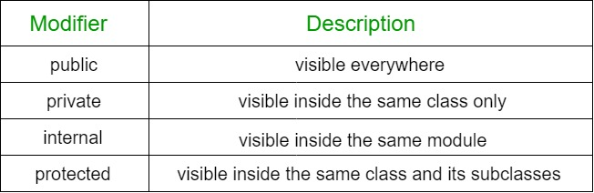

:memo: <span style="color:orange">MOBILE_001_KOTLIN_SYNTAX</span>

# TÌM HIỂU VỀ CLASS TRONG KOTLIN


## Table of Content

- [TÌM HIỂU VỀ CLASS TRONG KOTLIN](#tìm-hiểu-về-class-trong-kotlin)
  - [Table of Content](#table-of-content)
  - [I. Class](#i-class)
    - [1. Khai báo](#1-khai-báo)
    - [2. Visibility modifiers](#2-visibility-modifiers)
      - [Package](#package)
        - [Đối với các thành phần trong Class](#đối-với-các-thành-phần-trong-class)
      - [Nested và Inner Classes](#nested-và-inner-classes)
      - [Companion Object](#companion-object)
  - [II. Special Class](#ii-special-class)
    - [1. Data Class](#1-data-class)
      - [Khai báo thuộc tính trong thân Class](#khai-báo-thuộc-tính-trong-thân-class)
      - [Copying](#copying)
    - [2. Enum Class](#2-enum-class)
    - [3. Sealed Class](#3-sealed-class)

## I. Class

>**Class** là sự trừu tượng hóa của **Object**. Những đối tượng có những đặc tính tương tự nhau sẽ được tập hợp thành một **Class**. **Class** cũng sẽ bao gồm 2 thông tin là _**thuộc tính**_ và **_phương thức_**.
  
### 1. Khai báo

- **Classes** trong Kotlin được khai báo bằng keyword `class`.
- Ví dụ:

    ```kotlin
    class Person { /*...*/ }
    ```

- Khai báo một `class` bao gồm:
  - Tên class. 
  - Tiêu đề class, chỉ định tham số, constructor, ...
  - Thân class, được bao quanh bởi dấu `{}`. 
- Tiêu đề và thân `class` là không bắt buộc. Nếu `class` đó không có thân, có thể bỏ qua dấu `{}`.
- Ví dụ:

    ```kotlin
    class Empty
    ```

### 2. Visibility modifiers

- `Class`, `Object`, `Interface`, ... có thể có Access modifier (hay Visibility modifier). 
- Trong Kotlin, có 4 loại bao gồm: `private`, `protected`, `internal`, and `public`. 
- Kiểu truy cập mặc định là `public`.



#### Package

- `Function`, `Property`, `Class`, `Object` và `Interface` đều có thể khai báo ở mức "top-level" trực tiếp trong package, không ở bên trong bất cứ thành phần nào.
- Ví dụ:

    ```kotlin
    // file name: example.kt
    package foo

    fun baz() { ... }
    class Bar { ... }
    ```

  - Nếu không sử dụng `visibility modifier`, mặc định sẽ là `public` : khai báo có thể sử dụng ở mọi nơi.
  - `private` : chỉ được sử dụng bên trong file được khai báo.
  - `internal` : được sử dụng ở những nơi cùng `module`.
  - `protected` : không được sử dụng khai báo ở mức top-level.
- Ví dụ:

    ```kotlin
    // file name: example.kt
    // file name: example.kt
    package foo

    private fun foo() { ... } // visible inside example.kt

    public var bar: Int = 5 // property is visible everywhere
    private set         // setter is visible only in example.kt

    internal val baz = 6    // visible inside the same module
    ```

##### Đối với các thành phần trong Class

- `private` cho phép thành phần đó chỉ được truy cập bên trong class (bao gồm tất cả các thành phần của nó).
- `protected` có phạm vi truy cập giống với private, nhưng ngoài ra còn cho phép truy cập từ subclass (class con).
- `internal` cho phép truy cập từ bất cứ đâu trong module chứ thành phần đó.
- `public` cho phép truy cập ở mọi nơi.

:bulb: Trong Kotlin, class bên ngoài không thể truy cập vào các thành phần private của class nằm trong nó.

- Nếu override 1 thành phần `protected` hoặc `internal` mà không xác định rõ ràng phạm vị truy cập, chúng vẫn sẽ giữ nguyên phạm vi truy cập như ban đầu.
- Ví dụ:

    ```kotlin
    open class Outer {
        private val a = 1
        protected open val b = 2
        internal open val c = 3
        val d = 4  // public by default

        protected class Nested {
            public val e: Int = 5
        }
    }

    class Subclass : Outer() {
        // a is not visible
        // b, c and d are visible
        // Nested and e are visible

        override val b = 5   // 'b' is protected
        override val c = 7   // 'c' is internal
    }

    class Unrelated(o: Outer) {
        // o.a, o.b are not visible
        // o.c and o.d are visible (same module)
        // Outer.Nested is not visible, and Nested::e is not visible either
    }
  ```

- Cú pháp chỉ định khả năng hiển thị của `primary constructor` của một `class`:
  
    ```kotlin
    class C private constructor(a: Int) { ... }
    ```
  
:bulb: Cần phải thêm một từ khóa `constructor` rõ ràng. 

- Đối với `sealed classes`, constructors mặc định là `protected`.
- Các biến cục bộ, hàm và cả các `Class` đều không có **Access Modifier**.

#### Module 

> Là 1 tập hợp các file Kotlin được compile cùng nhau.
>- Ví dụ:
>  - 1 module IntelliJ IDEA. 
>  - 1 Maven project.
>  - ...

- `internal` được sử dụng trong phạm vi cùng 1 module.

### 3. Class Member

#### Constructor và Initializer Blocks

- Mỗi `class` có 1 `primary constructor` và có thể có 1 hoặc nhiều `secondary constructor`.
  - `primary constructor` là một phần của **Class Header**, được đặt ngay sau tên `Class` và các kiểu tham số tùy chọn.
    
  ```kotlin
  class Person constructor(firstName: String) { /*...*/ }
  ```

  - Nếu `primary constructor` không có bất cứ `annotation` hay `visibility modifier`, từ khóa `constructor` có thể được bỏ qua.

  ```kotlin
  class Person(firstName: String) { /*...*/ }
  ```

  - `primary constructor` khởi tạo một `class instance` và các thuộc tính của nó trong **Class Header**.

:bulb: **Class Header** không chứa bất cứ đoạn code nào. Nếu muốn chạy code trong khi khởi tạo object,  dùng `initializer blocks` trong **Class Body** với từ khóa `init`.

- Trong quá trình khởi tạo của 1 `instance` (thực thể), `initializer blocks` được thực thi theo cùng 1 thứ tự sắp xếp trong **Class Body**, đan xen với việc khởi tạo các thuộc tính.

  ```kotlin
  class InitOrderDemo(name: String) {
    val firstProperty = "First property: $name".also(::println)
    
    init {
        println("First initializer block that prints $name")
    }
    
    val secondProperty = "Second property: ${name.length}".also(::println)
    
    init {
        println("Second initializer block that prints ${name.length}")
    }
  }

  fun main() {
    InitOrderDemo("hello")
  }
  ```

- Các tham số của `primary constructor` có thể được dùng trong `initializer block`. Và cả trong `property initializer` (khởi tạo thuộc tính) được khai báo trong **Class Body**.

  ```kotlin
  class Customer(name: String) { 
    val customerKey = name.uppercase()
  }
  ```

- Trong Kotlin tồn tại 1 cú pháp ngắn ngọn cho việc khai báo thuộc tính và khởi tạo chúng ngay trong `primary constructor`.

  ```kotlin
  class Person(val firstName: String, val lastName: String, var age: Int)
  ```

- Bên cạnh `primary constructor`, 1 `Class` có thể có thêm `secondary constructor` với từ khóa `constructor`.
- Nếu `Class` có `primary constructor` thì các `second constructor` sẽ phải khởi tạo các giá trị của `primary constructor`. Sử dụng từ khóa `this`.

  ```kotlin
  class Constructors {
    constructor(i: Int) {
        println("Constructor $i")
    }

    init {
        println("Init block")
    }
  }

  fun main() {
    val first: Constructors = Constructors(2)
  }
  // "Init block"
  // "Constructor 2"
  ```

#### Nested và Inner Classes

- Một `class` có thể được lồng trong `class` khác. Tương tự, các `interface` và `class` có thể lồng nhau.

  ```kotlin
  class Constructors {
    class Outer {
    private val bar: Int = 1
    class Nested {
        fun foo() = 2
    }
  }

  val demo = Outer.Nested().foo()
  // == 2
  ```

- `Inner Class` là một `class` được khởi tạo bên trong một `class` khác, sử dụng từ khóa inner.
- `Inner Class` giữ một tham chiếu đến một đối tượng của `outer class`. 
- Có thể truy cập vào các thành phần của `outer class`.
- Giống một `function`. 

  ```kotlin
  class Outer {
    private val bar: Int = 1
    inner class Inner {
        fun foo() = bar
    }
  }

  val demo = Outer().Inner().foo() 
  // == 1
  ```

#### Companion Object

- Có thể khai báo đối tượng trong một `class` qua từ khóa `companion`.

  ```kotlin
  class MyClass {
    companion object Factory {
      fun create(): MyClass = MyClass()
    }
  }
  ```

- Có thể truy cập các thành phần của `companion object` bằng `class name`.

  ```kotlin
  val instance = MyClass.create()
  ```

## II. Special Class

### 1. Data Class

> Là một class đặc biệt được sử dụng để lưu trữ dữ liệu.

- Để khai báo một `Data class`, sử dụng từ khóa `data` trước khi khai báo `class`.

  ```kotlin
  data class User(val name: String, val age: Int)
  ```

- Trình biên dịch tự động tạo ra các thành phần sau từ tất cả các thuộc tính được khai báo trong `primary constructor`:
  - .equals() và .hashCode(): So sánh.
  - .toString(): Trả về đối tượng dưới dạng chuỗi.
  - .componentN(): Các hàm tương ứng với thứ tự khai báo các thuộc tính.
  - .copy(): Tạo ra một bản sao của đối tượng.
- Để đảm bảo tính nhất quán và hành vi có ý nghĩa của code được tạo, các lớp dữ liệu phải đáp ứng các yêu cầu sau:
  - `Primary constructor` phải được tạo ra với ít nhất 1 tham số.
  - Tham số của `primary constructor` phải được đánh dấu là `val` hoặc `var`.
  - `Data class` không thể là `abstract`, `open`, `sealed` hoặc `inner`.
  
#### Khai báo thuộc tính trong thân Class

- Trình biên dịch chỉ sử dụng các thuộc tính được định nghĩa trong `primary constructor` cho việc tự động tạo hàm. Để loại trừ thuộc tính từ việc triển khai, ta khai báo nó trong `class body`:

  ```kotlin
  data class Person(val name: String) {
    var age: Int = 0
  }
  ```

- Lúc này, chỉ thộc tính name dược sử dụng với các triển khai `toString()`, `equals()`, `hashCode()`, và `copy()`.Và sẽ chỉ có 1 component function. Dù 2 đối tược Person có tuổi khác nhau, chúng vẫn được coi là như nhau.

  ```kotlin
  data class Person(val name: String) {
    var age: Int = 0
  }

  fun main() {
    val person1 = Person("Trang")
    val person2 = Person("Trang")
    person1.age = 10;
    person2.age = 15;
    println(person1 == person2) // true
  }
  ```

#### Copying

- Ta có thể sử dụng hàm `.copy()` để copy 1 đối tượng, cho phép ta thay thế 1 vài thuộc tính trong khi giữ phần còn lại không đổi.

  ```kotlin
  data class Person(val name: String, val age: Int)

  fun main() {
    val person1 = Person("A", 3)
    val person2 = person1.copy(age = 2)

    println(person1) 
    println(person2) 
    // Person(name=A, age=3)
    // Person(name=A, age=2)
  }
  ```

### 2. Enum Class

> Là một `class` đặc biệt được sử dụng để định nghĩa một tập hợp các hằng số có thể được sử dụng trong một kiểu dữ liệu.

- Để khai báo một `enum class` trong Kotlin, sử dụng từ khóa `enum class`:

  ```kotlin
  enum class Direction {
    NORTH, SOUTH, WEST, EAST
  }

  enum class Color(val rgb: Int) {
    RED(0xFF0000),
    GREEN(0x00FF00),
    BLUE(0x0000FF)
  }
  ```

- Mỗi hằng số enum là 1 đối tượng, được ngăn cách nhau bằng dấu phẩy.
- Mỗi hằng số enum đều có các thuộc tính: name và ordinal, để hỗ trợ việc truy cập tên và vị trí của chúng (bắt đầu từ 0) trong việc khai báo của enum Class.

  ```kotlin
  enum class RGB { RED, GREEN, BLUE }

  fun main() {
    println(RGB.RED.name) 
    println(RGB.GREEN.ordinal) 
    // RED
    // 1
  }
  ```

- Enum Class trong Kotlin tồn tại các phương thức để liệt kê các hằng số enum và truy xuất qua tên:

  ```kotlin
  EnumClass.valueOf(value: String): EnumClass
  EnumClass.values(): Array<EnumClass>
  ```

- Ví dụ:

  ```kotlin
  enum class RGB { RED, GREEN, BLUE }

  fun main() {
    for (color in RGB.values()) println(color.toString()) 
    println("The first color is: ${RGB.valueOf(RGB.GREEN.name)}") 
  }
  //RED
  //GREEN
  //BLUE
  //The first color is: GREEN
  ```

### 3. Sealed Class

- `Sealed class` cung cấp khả năng kế thừa có kiểm soát.
- Để khai báo `sealed class` sử dụng từ khóa sealed. Một sealed class được ngầm định là abstract do đó không thể được khởi tạo trực tiếp.

  ```kotlin
  sealed class Error(val message: String) {
    class NetworkError : Error("Network failure")
    class DatabaseError : Error("Database cannot be reached")
    class UnknownError : Error("An unknown error has occurred")
  }

  fun main() {
    val errors = listOf(Error.NetworkError(), Error.DatabaseError(), Error.UnknownError())
    errors.forEach { println(it.message) }
  }
  // Network failure 
  // Database cannot be reached 
  // An unknown error has occurred
  ```

- Sử dụng `sealed class` với biểu thức when:

  ```kotlin
  // Sealed class and its subclasses
  sealed class Error {
    class FileReadError(val file: String): Error()
    class DatabaseError(val source: String): Error()
    object RuntimeError : Error()
  }

  // Function to log errors
  fun log(e: Error) = when(e) {
    is Error.FileReadError -> println("Error while reading file ${e.file}")
    is Error.DatabaseError -> println("Error while reading from database ${e.source}")
    Error.RuntimeError -> println("Runtime error")
    // No `else` clause is required because all the cases are covered
  }

  // List all errors
  fun main() {
    val errors = listOf(
        Error.FileReadError("example.txt"),
        Error.DatabaseError("usersDatabase"),
        Error.RuntimeError
    )

    errors.forEach { log(it) }
  }
  //Error while reading file example.txt
  //Error while reading from database usersDatabase
  //Runtime error
  ```
