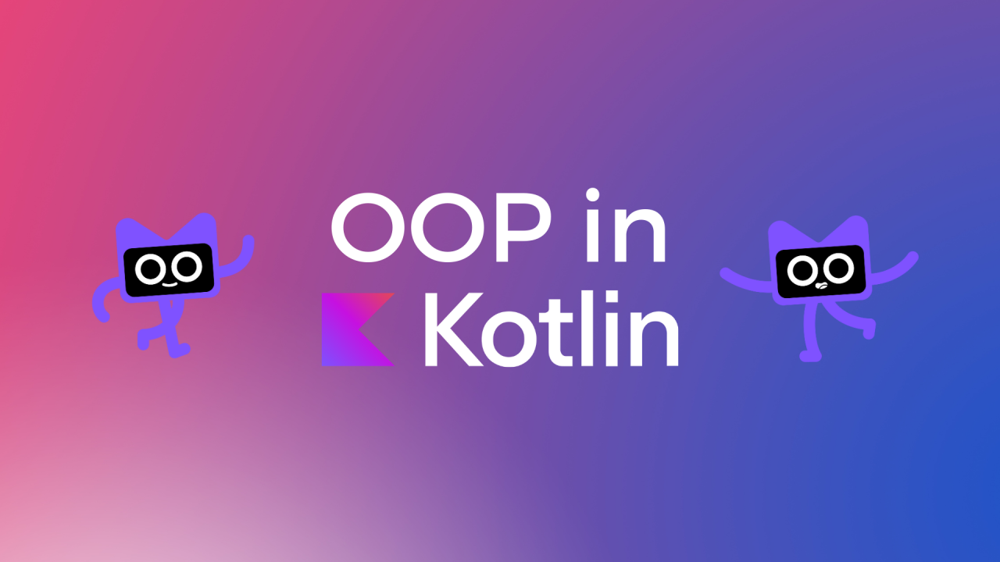

:memo: <span style="color:orange">MOBILE_003_KOTLIN_OOP</span>

# OOP VÀ BACKING FIELD TRONG KOTLIN



4 tính chất OOP: Encapsulation, Inheritance, Polymorphism, Abstraction.
Backing field.

## Table of Content

- [OOP VÀ BACKING FIELD TRONG KOTLIN](#oop-và-backing-field-trong-kotlin)
  - [Table of Content](#table-of-content)
  - [I. Các tính chất của OOP trong Kotlin](#i-các-tính-chất-của-oop-trong-kotlin)
    - [1. Encapsulation (Đóng gói)](#1-encapsulation-đóng-gói)
    - [2. Inheritance (Kế thừa)](#2-inheritance-kế-thừa)
      - [Các phương thức Overriding](#các-phương-thức-overriding)
      - [Các thuộc tính Overriding](#các-thuộc-tính-overriding)
      - [Trật tự khởi tạo Derived Class](#trật-tự-khởi-tạo-derived-class)
      - [Gọi việc triển khai Superclass](#gọi-việc-triển-khai-superclass)
      - [Quy tắc Overriding](#quy-tắc-overriding)
    - [3. Polymorphism (Đa hình)](#3-polymorphism-đa-hình)
    - [4. Abstraction (Trừu tượng)](#4-abstraction-trừu-tượng)
  - [II. Backing field](#ii-backing-field)

## I. Các tính chất của OOP trong Kotlin
  
### 1. Encapsulation (Đóng gói)

> Bao gồm các thuộc tính và phương thức liên quan giúp thực hiện hành động trên các thuộc tính đó trong một lớp.
> *Lấy điện thoại di động làm ví dụ. Sản phẩm này bao gồm một máy ảnh, màn hình, thẻ nhớ cùng một số phần cứng và phần mềm khác. Người dùng không cần phải lo lắng về cách các thành phần bên trong kết hợp với nhau.*

- Ví dụ: Yêu cầu của ứng dụng là hiệu trưởng chỉ có thể được xem danh sách tất cả học sinh và thêm học sinh vào danh sách. Đóng gói là cách để thực hiện điều đó.

  ```kotlin
  class Principal(){
    private var studentsName = mutableListOf<String>()
    ...
    
    fun getStudentsName(): List<String>{
      return studentsName
    }
  }
  ```

  - Tên học sinh đã được ẩn đi và chỉ có thể truy cập thông qua phương thức `getStudentsName`. Cách duy nhất để chỉnh sửa nó là can thiệp vào class bằng cách sử dụng `Visibility modifiers`.

### 2. Inheritance (Kế thừa)

> Cho phép người dùng tạo lớp dựa trên đặc điểm và hành vi của các lớp khác bằng cách thiết lập mối quan hệ cha-con.
> *Ví dụ: có nhiều nhà sản xuất chế tạo ra nhiều thiết bị di động chạy Android OS nhưng giao diện người dùng cho từng thiết bị là khác nhau. Nói cách khác, nhà sản xuất kế thừa tính năng của hệ điều hành Android và tuỳ chỉnh dựa trên tính năng đó.*

- Kế thừa hỗ trợ khả năng tái sử dụng. Nó làm giảm số lượng mã mẫu cần phải viết.
- Tất cả `class` trong Kotlin có 1 `superclass` là `Any` - `superclass` mặc định cho một lớp không được khai báo `superclass`.
- `Any` thì có 3 phương thức: `equals()`, `hashCode()`, `toString()`.Các phương thức này đều được định nghĩa cho tất cả các `class` trong Kotlin.
- Trong Kotlin, mọi class mặc định là `final`. Để class có thể kế thừa, cần sử dụng từ khóa `open`:

  ```kotlin
  open class Base // Class is open for inheritance
  ```

- Để khai báo một `supertype` rõ ràng, đặt `type` sau dấu `:` trong `class header`:

  ```kotlin
  open class Base(p: Int)

  class Derived(p: Int) : Base(p)
  ```

- Nếu class có `primary constructor`, thì các subclass phải được khởi tạo bằng các tham số của `primary constructor`.

  ```kotlin
  open class Vehicle(val model: String) {
    init {
        println("Vehicle model is $model")
    }
  }
  class Car(model: String, val color: String) : Vehicle(model) {
    init {
        println("Car color is $color")
    }
  }

  fun main() {
    val myCar = Car("Toyota", "Red")
    // Output:
    // Vehicle model is Toyota
    // Car color is Red
  }
  ```

- Trong trường hợp không có `primary constructor` , mỗi hàm tạo phụ phải khởi tạo kiểu cơ sở bằng cách sử dụng từ khóa super hoặc nó phải ủy quyền cho một hàm tạo khác thực hiện. Lưu ý rằng trong trường hợp này, các hàm tạo phụ khác nhau có thể gọi các hàm tạo khác nhau của kiểu cơ sở.

  ```kotlin
  open class Vehicle {
    constructor(model: String) {
        println("Vehicle model is $model")
    }

    constructor(model: String, year: Int) {
        println("Vehicle model is $model, year is $year")
    }
  }
  class Motorcycle : Vehicle {
    constructor(model: String) : super(model) {
        println("Motorcycle model is $model")
    }

    constructor(model: String, year: Int) : super(model, year) {
        println("Motorcycle model is $model, year is $year")
    }
  }

  fun main() {
    val myMotorcycle1 = Motorcycle("Harley")
    // Output:
    // Vehicle model is Harley
    // Motorcycle model is Harley

    val myMotorcycle2 = Motorcycle("Ducati", 2020)
    // Output:
    // Vehicle model is Ducati, year is 2020
    // Motorcycle model is Ducati, year is 2020
  }

  ```

#### Các phương thức Overriding

- Kotlin yêu cầu các modifier rõ ràng cho các thành viên có thể override và các override.

  ```kotlin
  open class Shape {
    open fun draw() { /*...*/ }
    fun fill() { /*...*/ }
  }

  class Circle() : Shape() {
    override fun draw() { /*...*/ }
  }
  ```

- Nếu thiếu modifier `override` trình biên dịch sẽ báo lỗi.
- Nếu phương thức không `open`, như `Shape.fill()`, không thể khai pháp một phương thức trùng lặp trong `subclass`, dù có sử dụng cụm từ `override`.
- `open` sẽ không có tác dụng khi thêm vào các thành viên của `final class`.
- Nếu một thành viên được đánh dấu là `override` thì cũng là `open`, nên có thể được `override` trong các `subclass`. Nếu muốn cấm `override`, thêm từ khóa `final`.

  ```kotlin
  open class Rectangle() : Shape() {
    final override fun draw() { /*...*/ }
  }
  ```

#### Các thuộc tính Overriding

- Cơ chế `overriding` hoạt động trên các thuộc tính theo cách tương tự như trên các phương thức.
Các thuộc tính được khai báo trên `superclass` sau đó được khai báo lại trên `derived class` phải được bắt đầu bằng `override`, và chúng phải có một kiểu tương thích.
- Mỗi thuộc tính được khai báo có thể được ghi đè bởi một thuộc tính có một trình khởi tạo hoặc bởi một thuộc tính có một phương thức `get`.

  ```kotlin
  open class Shape {
    open val vertexCount: Int = 0
  }

  class Rectangle : Shape() {
    override val vertexCount = 4
  }
  ```

- Có thể ghi đè một thuộc tính `val` bằng một thuộc tính `var`, nhưng không được phép ngược lại.

  ```kotlin
  interface Shape {
    val vertexCount: Int
  }

  class Rectangle(override val vertexCount: Int = 4) : Shape 
  // Always has 4 vertices

  class Polygon : Shape {
    override var vertexCount: Int = 0  
    // Can be set to any number later
  }
  ```

#### Trật tự khởi tạo Derived Class

- Trong quá trình xây dựng `instance` của `derived class`, việc khởi tạo lớp cơ sở được thực hiện như bước đầu tiên (chỉ sau khi đánh giá các đối số cho hàm tạo lớp cơ sở), nghĩa là nó xảy ra trước khi logic khởi tạo của lớp dẫn xuất được chạy.

  ```kotlin
  open class Base(val name: String) {

    init { println("Initializing a base class") }

    open val size: Int =
        name.length.also { println("Initializing size in the base class: $it") }
  }

  class Derived(
    name: String,
    val lastName: String,
  ) : Base(name.replaceFirstChar { it.uppercase() }.also { println("Argument for the base class: $it") }) {

    init { println("Initializing a derived class") }

    override val size: Int =
        (super.size + lastName.length).also { println("Initializing size in the derived class: $it") }
  }

  fun main() {
    println("Constructing the derived class(\"hello\", \"world\")")
    Derived("hello", "world")
    // Constructing the derived class("hello", "world")
    //Argument for the base class: Hello
    //Initializing a base class
    //Initializing size in the base class: 5
    //Initializing a derived class
    //Initializing size in the derived class: 10
  }
  ```

- Điều này có nghĩa là khi hàm tạo lớp cơ sở được thực thi, các thuộc tính được khai báo hoặc ghi đè trong `derived class` vẫn chưa được khởi tạo.
- Do đó, khi thiết kế lớp cơ sở, bạn nên tránh sử dụng `open members` trong các hàm tạo, trình khởi tạo thuộc tính hoặc `init blocks`.

#### Gọi việc triển khai Superclass

- Trong một `derived class` có thể gọi đến hàm và truy cập thuộc tính của lớp cha bằng cách sử dụng từ khóa `super`.

  ```kotlin
  open class Rectangle {
    open fun draw() {
        println("Drawing a rectangle")
    }
    val borderColor: String
        get() = "black"
  }

  class FilledRectangle : Rectangle() {
    override fun draw() {
        super.draw()
        println("Filling the rectangle")
    }

    val fillColor: String
        get() = super.borderColor
  }

  fun main() {
    val filledRectangle = FilledRectangle()
    filledRectangle.draw()
    //Drawing a rectangle
    //Filling the rectangle
    println("Fill color: ${filledRectangle.fillColor}")
    //Fill color: black
  }
  ```

- Bên trong một `inner class`, việc truy cập `super class` của `outer class` được thực hiện bằng cách sử dụng `super` cùng với tên `outer class`: super@Outer.

  ```kotlin
  open class Rectangle {
    open fun draw() { println("Drawing a rectangle") }
    val borderColor: String get() = "black"
  }

  class FilledRectangle: Rectangle() {
    override fun draw() {
        val filler = Filler()
        filler.drawAndFill()
    }

    inner class Filler {
        fun fill() { println("Filling") }
        fun drawAndFill() {
            super@FilledRectangle.draw() // Calls Rectangle's implementation of draw()
            fill()
            println("Drawn a filled rectangle with color ${super@FilledRectangle.borderColor}") // Uses Rectangle's implementation of borderColor's get()
        }
    }
  }

  fun main() {
    val fr = FilledRectangle()
        fr.draw()
  }
  // Drawing a rectangle
  // Filling
  // Drawn a filled rectangle with color black
  ```

#### Quy tắc Overriding

- Nếu một lớp kế thừa nhiều `implementation` của cùng một thành viên từ các `superclass` của nó, thì lớp đó phải `override` thành viên này và cung cấp triển khai riêng của mình (có thể sử dụng một trong những triển khai được kế thừa).
- Để gọi đến các thành phần thuộc các class, interface cha khác nhau thì ta sử dụng `super<Base>`.

  ```kotlin
  open class Rectangle {
    open fun draw() {
        println("Drawing a rectangle")
    }
  }

  interface Polygon {
    fun draw() {
        println("Drawing a polygon")
    }
  }

  class Square : Rectangle(), Polygon {
    override fun draw() {
        super<Rectangle>.draw() // gọi đến Rectangle.draw()
        super<Polygon>.draw() // gọi đến Polygon.draw()
    }
  }

  fun main() {
    val square = Square()
    square.draw()
  }
  ```

### 3. Polymorphism (Đa hình)

> Từ này được phỏng theo và có nguồn gốc từ Hy Lạp poly-, có nghĩa là nhiều, và -morphism, là các dạng. Tính đa hình là khả năng sử dụng các đối tượng khác nhau theo một cách chung.
> *Ví dụ: khi người dùng kết nối loa Bluetooth với điện thoại di động, điện thoại chỉ cần biết có một thiết bị có thể phát âm thanh bằng Bluetooth. Tuy nhiên, có nhiều loa Bluetooth để bạn chọn và điện thoại không cần phải biết cụ thể cách làm việc với từng loa.*

### 4. Abstraction (Trừu tượng)

> Là phần mở rộng của việc đóng gói. Với mục đích là ẩn logic triển khai bên trong càng nhiều càng tốt.
> *Ví dụ: để chụp ảnh bằng điện thoại di động, người dùng cần mở ứng dụng máy ảnh, hướng điện thoại đến nơi muốn chụp và nhấp vào nút để chụp ảnh. Họ không cần phải biết cách phát triển ứng dụng máy ảnh hoặc phần cứng máy ảnh trên điện thoại di động thực tế hoạt động như thế nào. Tóm lại, cơ chế nội bộ của ứng dụng máy ảnh và cách máy ảnh trên thiết bị di động chụp ảnh sẽ được tóm tắt để người dùng thực hiện các tác vụ cần thiết.*

## II. Backing field


