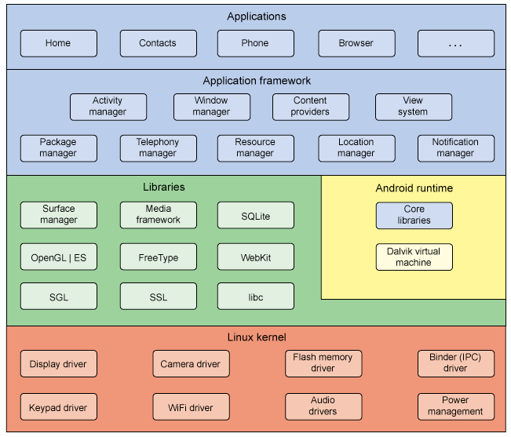
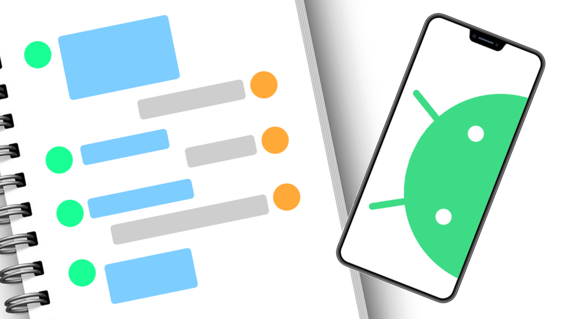

:memo: <span style="color:orange">MOBILE_006_ANDROID_OVERVIEW</span>

# ANDROID OVERVIEW VÀ BASIC LAYOUT


- Android Overview:
  - Giới thiệu về hệ điều hành android và IDE android studio
  - Tìm hiểu về android folder project structure trong IDE android studio ( manifest, java, res, gradle scripts,...).
  - Giới thiệu về xml.
  - Các tool cơ bản có trong android studio (debugger, log cat, layout inspector,...).
  - Các view cơ bản trong android ( TextView, Button , ImageView ,...)
- Basic Layout:
  - FrameLayout, ConstraintLayout,… (Tập trung tìm hiểu kĩ ConstraintLayout, các layout khác đọc qua thôi cũng được).
  - ViewBinding và cách sử dụng.

## Table of Content

- [ANDROID OVERVIEW VÀ BASIC LAYOUT](#android-overview-và-basic-layout)
  - [Table of Content](#table-of-content)
  - [I. Android Overview](#i-android-overview)
    - [1. Giới thiệu về Hệ điều hành Android](#1-giới-thiệu-về-hệ-điều-hành-android)
    - [2. IDE Android Studio](#2-ide-android-studio)
    - [3. Folder Project Structure trong IDE Android Studio](#3-folder-project-structure-trong-ide-android-studio)
    - [4. Giới thiệu về xml](#4-giới-thiệu-về-xml)
    - [5. Các tool cơ bản có trong Android Studio](#5-các-tool-cơ-bản-có-trong-android-studio)
    - [6. Các view cơ bản trong Android](#6-các-view-cơ-bản-trong-android)
      - [Tạo View trong Android](#tạo-view-trong-android)
      - [Các thuộc tính của View](#các-thuộc-tính-của-view)
      - [Các View cơ bản](#các-view-cơ-bản)
  - [II. Basic Layout](#ii-basic-layout)
    - [1. ConstraintLayout](#1-constraintlayout)
    - [2. ViewBinding](#2-viewbinding)

## I. Android Overview

### 1. Giới thiệu về Hệ điều hành Android

> Android là hệ điều hành mã nguồn mở, dựa trên Linux Kernel, dành cho các thiết bị di động nói chung (điện thoại, máy tính bảng, đồng hồ thông minh, máy nghe nhạc,…). Android được phát triển bởi Android Inc. với sự hỗ trợ tài chính từ Google và sau này được chính Google mua lại vào năm 2005.

- Android không chỉ giới hạn trong phạm vi một hệ điều hành cho điện thoại! Nó có thể được nhà sản xuất cài đặt lên đồng hồ, máy nghe nhạc, thiết bị định vị GPS, thậm chí là ô tô (các thiết bị Android Auto).

- Android cũng không phải là một thiết bị hay sản phẩm cụ thể, nó là một hệ điều hành dựa trên Linux, nguồn mở, linh hoạt. Có khả năng tùy biến rất cao và có thể chạy trên nhiều thiết bị, nhiều kiến trúc vi xử lý (ARM / x86).

- Kiến trúc của hệ điều hành Android:

  

  - **Tầng Applications**: Là tầng chứa các ứng dụng Danh bạ, Gọi điện, Trình duyệt, Nghe nhạc,… các ứng dụng này thường mua máy về chúng ta đã có sẵn rồi.
  - **Tầng Framework**: Là tầng chứa các API để làm việc với hệ điều hành như lấy thông tin danh bạ, quản lý các Activity (Activity là gì thì giờ chúng ta chưa cần quan tâm, các bài sau sẽ giải thích kĩ), quản lý địa điểm, quản lý các View (cũng chưa cần quan tâm).
  - **Tầng Libraries**: Chứa các thư viện, API gần như là cốt lõi của Android, bao gồm bộ quản lý bề mặt cảm ứng (Surface Manager), OpenGL (phục vụ cho việc dựng đồ họa phức tạp),…
  - **Tầng Android Runtime**: Chứa các thư viện lõi của Android và máy ảo Dalvik Virtual Machine (từ Android 4 trở lên chúng ta có thêm máy ảo ART).
  - **Tầng Kernel**: Là nhân lõi của hệ điều hành, chứa các tập lệnh, driver giao tiếp giữa phần cứng và phần mềm của Android.
- Trong quá trình làm việc, chúng ta sẽ gần như chỉ làm việc với tầng xanh lam (Applications và Application Framework) và xanh lá (Libraries). Chương trình Android được viết bằng ngôn ngữ Java và được máy ảo DVM / ART trong mỗi thiết bị Android biên dịch ra mã máy.

### 2. IDE Android Studio

> Android Studio là Môi trường phát triển tích hợp (IDE) chính thức để phát triển ứng dụng Android. Nhờ có công cụ cho nhà phát triển và trình soạn thảo mã mạnh mẽ của IntelliJ IDEA.

  

- Android Studio cung cấp thêm nhiều tính năng giúp bạn nâng cao năng suất khi xây dựng ứng dụng Android, chẳng hạn như:
  - Một hệ thống xây dựng linh hoạt dựa trên Gradle
  - Một trình mô phỏng nhanh và nhiều tính năng
  - Một môi trường hợp nhất nơi bạn có thể phát triển cho mọi thiết bị Android
  - Tính năng Live Edit (Chỉnh sửa trực tiếp) để cập nhật các thành phần kết hợp trong trình mô phỏng và thiết bị thực theo thời gian thực
  - Mã mẫu và quá trình tích hợp GitHub để giúp bạn xây dựng các tính năng ứng dụng phổ biến cũng như nhập mã mẫu
  - Đa dạng khung và công cụ thử nghiệm
  - Công cụ tìm lỗi mã nguồn (lint) để nắm bắt hiệu suất, khả năng hữu dụng, khả năng tương thích với phiên bản và các vấn đề khác
  - Hỗ trợ C++ và NDK
  - Tích hợp sẵn tính năng hỗ trợ Google Cloud Platform, giúp dễ dàng tích hợp Google Cloud Messaging và App Engine

### 3. Folder Project Structure trong IDE Android Studio

- Mỗi dự án trong Android Studio chứa một hoặc nhiều mô-đun có tệp mã nguồn và tệp tài nguyên. Có các loại mô-đun sau:
  - Mô-đun ứng dụng Android
  - Mô-đun thư viện
  - Mô-đun Google App Engine
- Theo mặc định, Android Studio thể hiện các tệp dự án của bạn trong chế độ xem dự án Android, như trong hình 1. Khung hiển thị này được sắp xếp theo mô-đun để bạn có thể truy cập nhanh vào các tệp nguồn chính của dự án. Bạn có thể thấy mọi tệp bản dựng ở cấp cao nhất trong Gradle Scripts (Tập lệnh Gradle).

:bulb: Gradle là hệ thống xây dựng tự động và nó chứa một số tệp được sử dụng để xác định cấu hình bản dựng có thể áp dụng cho tất cả các module trong ứng dụng.

  

- Mỗi mô-đun ứng dụng có chứa các thư mục sau:
  - manifests (tệp kê khai): Chứa tệp AndroidManifest.xml.
  - java: Chứa các tệp mã nguồn Java và Kotlin, bao gồm cả mã kiểm thử JUnit.
  - res: Chứa mọi tài nguyên không phải đoạn mã, chẳng hạn như chuỗi giao diện người dùng và hình ảnh bitmap.

### 4. Giới thiệu về xml

> XML (eXtensible Markup Language, tức "Ngôn ngữ đánh dấu mở rộng") là một ngôn ngữ đánh dấu dữ liệu lưu trữ và truyền tải thông tin dưới dạng văn bản chuẩn để máy tính có thể đọc được. XML được thiết kế để mang tính linh hoạt cao, cho phép người dùng tự định nghĩa các thẻ, cấu trúc dữ liệu và thuộc tính. Điều này làm cho XML trở thành một công cụ mạnh mẽ để lưu trữ và truyền tải dữ liệu.

- Mục đích chính của XML là đơn giản hóa việc chia sẻ dữ liệu giữa các hệ thống khác nhau, đặc biệt là các hệ thống được kết nối với Internet.

- Cú pháp:
  - Thẻ: Mỗi phần tử trong XML được bao quanh bởi cặp thẻ mở và thẻ đóng. Ví dụ: `<tên_phần_tử> nội_dung </tên_phần_tử>`. Các phần tử có thể lồng nhau để tạo thành cấu trúc phân cấp.
  - Thuộc tính: Các phần tử có thể chứa các thuộc tính để cung cấp thông tin bổ sung. Ví dụ: `<book ISBN="12345">`.
  - Không gian tên: XML hỗ trợ việc sử dụng không gian tên để tránh xung đột giữa các tên phần tử và thuộc tính. Mỗi phần tử hoặc thuộc tính có thể được liên kết với một không gian tên cụ thể.
  - Khai báo XML: Câu lệnh khai báo XML (XML declaration) được sử dụng để xác định phiên bản của XML và mảng mã kí tự được sử dụng. Ví dụ: `<?xml version="1.0" encoding="UTF-8"?>`.
  - Chú thích: XML cho phép chú thích trong dữ liệu bằng cách sử dụng cú pháp `<!-- chú_thích -->`.
  - Entity references: XML hỗ trợ các tham chiếu đến các entity, cho phép sử dụng mã ký tự đặc biệt trong dữ liệu.
  - CDATA: XML cung cấp cú pháp để xác định các phần tử dữ liệu không cần xử lý, gọi là Section Dữ liệu Karagata (CDATA).

### 5. Các tool cơ bản có trong Android Studio

- **Debugger**: Giúp theo dõi và gỡ lỗi mã nguồn trong quá trình chạy của ứng dụng.
- **Logcat**: Giúp xem các thông báo ghi lại từ hệ thống và ứng dụng của bạn, giúp gỡ lỗi và khắc phục vấn đề.
- **Layout Inspector**: Giúp khám phá và kiểm tra các thành phần giao diện người dùng trong ứng dụng.
- **Memory Profiler**: Giúp phân tích và tối ưu hóa việc sử dụng bộ nhớ trong ứng dụng.
- **Android Profiler**: Giúp theo dõi hiệu suất ứng dụng về CPU, bộ nhớ, mạng và nguồn pin.

### 6. Các view cơ bản trong Android

> Những gì nhìn thấy trên màn hình thiết bị Android được gọi là View (trong Windows thường được gọi là Control). View được vẽ trên thiết bị Android với 1 hình chữ nhật.
    

#### Tạo View trong Android

- Để tạo View trong Android có thể sử dụng 2 cách sau:
  - Tạo View trong Android bằng XML.

    ```xml
    <TextView
     android:id="@+id/tv_Hello"
     android:layout_width="wrap_content"
     android:layout_height="wrap_content"
     android:background="#31a18c"
     android:textSize="18sp"
     android:textStyle="bold"
     android:text="Hello World!" />
    ```

  - Tạo View trong Android bằng Java.

    ```java
    TextView tvHello = new TextView(this);
    tvHello.setBackgroundColor(Color.parseColor("31a18c"));
    tvHello.setText("Hello World");
    ```

#### Các thuộc tính của View

- `layout_height`
  - Thuộc tính `layout_height` quy định **chiều cao** của `View` và có các giá trị như sau:
    - `wrap_content`: chiều cao của `View` phụ thuộc vào **content** của `View`.
    - Giá trị xác định: đơn vị chiều cao của `View` như dp, px, in, mm, sp, ...
    - `match_parent`: chiều cao của `View` sẽ bằng đúng chiều cao của phần tử cha chứa nó.
- `layout_width`
  - Thuộc tính `layout_width` quy định chiều rộng của `View` và có các giá trị như sau:
    - `match_width`: chiều rộng của `View` sẽ bằng đúng chiều rộng của phần tử cha chứa nó.
    - `wrap_content`: chiều rộng của `View` phụ thuộc vào content của `View`.
    - Giá trị xác định: đơn vị chiều rộng của `View` như dp, px, in, mm, sp, ...
- `id`
  - Thuộc tính `id` xác định id của `View`, được khai báo ở file định nghĩa giao diện **XML** và sử dụng lại trong code Java/Kotlin để ánh xạ đối tượng, tìm kiếm các `View` trong code Java khi cần.
  - Trong file XML:

    ```xml
    <TextView
     android:id="@+id/tv_message"
     android:layout_width="wrap_content"
     android:text="eitguide.com"
     android:layout_height="wrap_content"/>
    ```

  - Và ánh xạ đối tượng TextView trong XML thông qua id trong Java:

    ```java
    TextView tvMessage = (TextView)findViewById(R.id.tv_message);
    ```

- **background**
  - Thuộc tính `background` xác định màu nền của `View`.
  
    ```xml
    <TextView
      android:background="#ffffff" /> // white color
    ```

- **margin và padding**
  - `margin`: ****là khoảng cách từ các cạnh của `View` hiện tại tới các `View` khác.
  - `padding`: là khoảng cách từ các cạnh của `View` tới phần nội dung bên trong.

  

#### Các View cơ bản

- **TextView** : là một View để hiển thị và hiển thị văn bản trên màn hình. Nó có thể chứa văn bản tĩnh hoặc có thể được cập nhật động. TextView hỗ trợ các thuộc tính để tùy chỉnh văn bản như kích thước, màu sắc, kiểu chữ và căn chỉnh.
- **Button**: là một View dùng để tạo một nút tương tác mà người dùng có thể nhấn vào. Khi người dùng nhấn vào Button, bạn có thể thực hiện các hành động xử lý sự kiện liên quan.
- **ImageView**: là một View dùng để hiển thị hình ảnh. Bạn có thể đặt hình ảnh trong ImageView từ tài nguyên tệp tin hoặc từ đường dẫn tệp tin trên thiết bị. ImageView cũng hỗ trợ thuộc tính để cắt, sửa đổi kích thước và tùy chỉnh hình ảnh.
- **EditText**: là một View cho phép người dùng nhập và chỉnh sửa văn bản. Người dùng có thể nhập dữ liệu văn bản vào EditText và bạn có thể lấy giá trị đó để xử lý.
- **ListView**: là một View để hiển thị danh sách dọc. Nó cho phép bạn hiển thị danh sách các mục, như danh bạ liên lạc hoặc danh sách sản phẩm. Bạn có thể tạo một Adapter để cung cấp dữ liệu cho ListView và tùy chỉnh giao diện cho mỗi mục.
- **RecyclerView**: là một View hiệu suất cao hơn để hiển thị danh sách dữ liệu. Nó tương tự như ListView, nhưng cung cấp khả năng tái sử dụng các mục hiển thị và hỗ trợ tùy chỉnh mạnh mẽ hơn về giao diện và hiển thị dữ liệu.
- **CheckBox**: là một View cho phép người dùng chọn hoặc bỏ chọn một tùy chọn. Nó có thể có hai trạng thái: chọn (checked) hoặc không chọn (unchecked).
- **RadioButton**: là một View để hiển thị các lựa chọn tương tự như CheckBox, nhưng chỉ cho phép người dùng chọn một trong số các tùy chọn.

## II. Basic Layout

- 

### 1. ConstraintLayout

- 

### 2. ViewBinding

- 