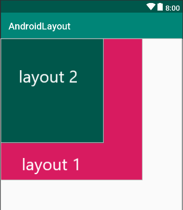
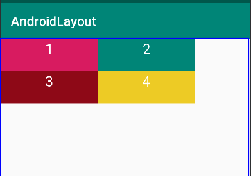
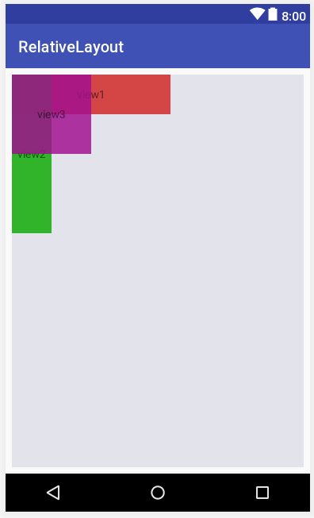
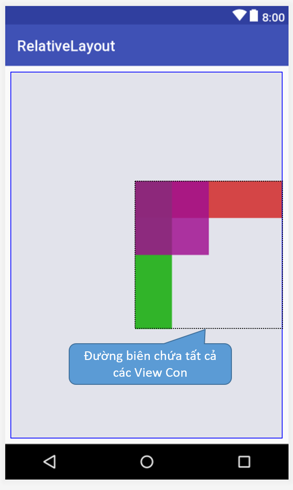
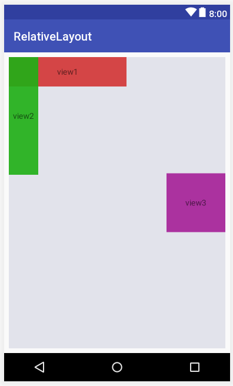
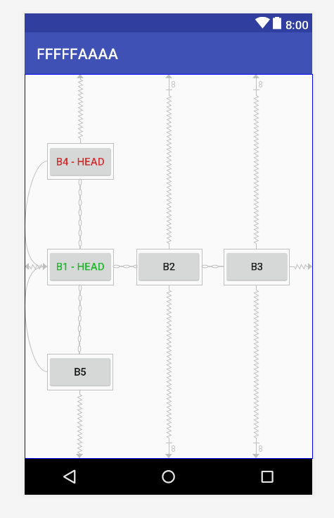
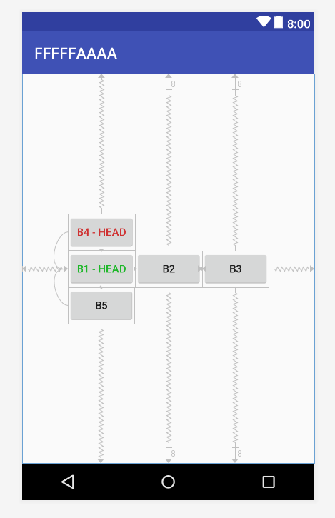
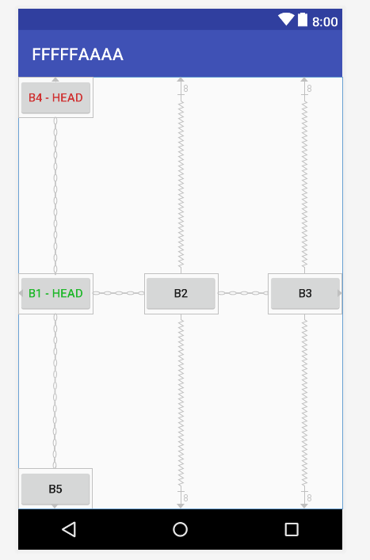

:memo: <span style="color:orange">MOBILE_007_ANDROID_LAYOUT</span>

# CÁC LAYOUT VÀ VIEWBINDING


- FrameLayout, RelativeLayout, ConstraintLayout.
- Cách sử dụng ViewBinding.

## Table of Content

- [CÁC LAYOUT VÀ VIEWBINDING](#các-layout-và-viewbinding)
  - [Table of Content](#table-of-content)
  - [I. Basic Layout](#i-basic-layout)
    - [1. Frame Layout](#1-frame-layout)
      - [Thuộc tính Frame Layout](#thuộc-tính-frame-layout)
    - [2. Relative Layout](#2-relative-layout)
    - [3. Constraint Layout](#3-constraint-layout)
      - [Sự ràng buộc](#sự-ràng-buộc)
      - [Thuộc tính Margin trong các phần tử con](#thuộc-tính-margin-trong-các-phần-tử-con)
      - [Phần tử Guideline](#phần-tử-guideline)
      - [Bias](#bias)
      - [Tỷ lệ các cạnh của View](#tỷ-lệ-các-cạnh-của-view)
      - [Chain - xích các View lại](#chain---xích-các-view-lại)
  - [II. View Binding](#ii-view-binding)
    - [1. Cài đặt](#1-cài-đặt)
    - [2. Sử dụng](#2-sử-dụng)

## I. Basic Layout

> Layout là thành phần định nghĩa cấu trúc giao diện người dùng hay nói cách khác là thành phần quyết định đến giao diện của một màn hình trong ứng dụng Android. Layout hỗ trợ việc căn chỉnh các widget (Ví dụ: TextView, Button, hay EditText…).

### 1. Frame Layout

> **FrameLayout** là một ViewGroup được sử dụng rất nhiều trong android.

- Nó là ViewGroup đơn giản nhất, và thời gian tính toán của nó để layout ra các view con trong nó là thấp nhất nên performance của ViewGroup này là cao nhất.
- Khi gắn các view lên layout này thì nó sẽ luôn giữ các view này ở phía góc trái màn hình và không cho thay đồi vị trí của chúng, các view đưa vào sau sẽ đè lên view ở trước trừ khi thiết lập `transparent` cho view sau đó.
- **FrameLayout** được định nghĩa bắt đầu bởi thẻ `<FrameLayout>` và thẻ đóng `</FrameLayout>`. Ở giữa thẻ đóng và thẻ mở chính là các view con của nó.

- Ví dụ:
  
  ```html
  <FrameLayout xmlns:android="http://schemas.android.com/apk/res/android"
    xmlns:tools="http://schemas.android.com/tools"
    android:layout_width="match_parent"
    android:layout_height="match_parent"
    tools:context=".MainActivity" >


    <TextView
        android:id="@+id/textView"
        android:layout_width="300dp"
        android:layout_height="300dp"
        android:background="@color/colorAccent"
        android:text="TextView" />

    <TextView
        android:id="@+id/textView2"
        android:layout_width="218dp"
        android:layout_height="221dp"
        android:background="@color/colorPrimaryDark" />
  </FrameLayout>
  ```
  
  

#### Thuộc tính Frame Layout

| Thuộc tính                 | Mô tả                                                                                                                                                                                        |
| -------------------------- | -------------------------------------------------------------------------------------------------------------------------------------------------------------------------------------------- |
| `android:id`                 | ID là duy nhất để nhận diện Layout                                                                                                                                                           |
| `android:foreground`         | Xác định **drawable** để vẽ lên nội dung và giá trị có thể có thể là một trong các giá trị màu dưới dạng “**#rgb**”, “**#argb**”, “**#rrggbb**” hoặc “**#aarrggbb**”.                                                                                                                                                         |
| `android:foregroundGravity`  | Xác định **gravity** để áp dụng cho nền trước có thể vẽ được. **Gravity** mặc định sẽ lấp đầy, giá trị có thể là trên cùng, dưới cùng, bên trái, bên phải, giữa, center_vertical, center_horizontal… |
| `android:measureAllChildren` | Xác định xem có đo lường tất cả **children** hay chỉ những **children** ở trạng thái **VISIBLE** hoặc **INVISIBLE**, mặc định là **FALSE**.                                                                      |

- Khi các View nằm trong FrameLayout thì khi gán thuộc tính android:layout_gravity gán các giá trị ở bảng sau vị trí của nó thay đổi tương ứng:
- Các giá trị có thể kết hợp bằng ký hiệu `|`

| Giá trị           | Vị trí của View con   |
| ----------------- | --------------------- |
| `bottom`            | Nằm dưới FrameLayout  |
| `center`            | Nằm giữa FrameLayout  |
| `center_horizontal` | Giữa theo chiều ngang |
| `center_vertical`   | Giữa theo chiều đứng  |
| `end`               | Cuối FrameLayout      |
| `left`              | Bên trái              |
| `right`             | Bên phải              |
| `start`             | Bắt đầu FrameLayout   |
| `top`               | Trên FrameLayout      |

### 2. Relative Layout

> **RelativeLayout** là một ViewGroup có hiển thị các View con ở các vị trí tương đối. Vị trí của mỗi View có thể được quy định liên quan đến các View anh em (như bên trái của hoặc bên dưới một View khác) hoặc ở các vị trí tương đối với khu vực cha RelativeLayout(chẳng hạn như sắp xếp ngay phía dưới, bên trái hoặc trung tâm).

- Ví dụ:

  ```html
  <RelativeLayout xmlns:android="http://schemas.android.com/apk/res/android"
    android:layout_width="match_parent"
    android:layout_height="match_parent">

    <TextView
        android:layout_width="150dp"
        android:layout_height="50dp"
        android:text="1"
        android:textColor="#fff"
        android:id="@+id/hop1"
        android:textSize="10pt"
        android:textAlignment="center"
        android:background="@color/colorAccent" />

    <TextView
        android:layout_width="150dp"
        android:layout_height="50dp"
        android:text="2"
        android:textColor="#fff"
        android:id="@+id/hop2"
        android:textSize="10pt"
        android:textAlignment="center"
        android:layout_toRightOf="@+id/hop1"
        android:background="@color/colorPrimary" />

    <TextView
        android:layout_width="150dp"
        android:layout_height="50dp"
        android:text="3"
        android:textColor="#fff"
        android:id="@+id/hop3"
        android:background="#8e0917"
        android:textSize="10pt"
        android:textAlignment="center"
        android:layout_below="@+id/hop1" />

    <TextView
        android:layout_width="150dp"
        android:layout_height="50dp"
        android:text="4"
        android:textColor="#fff"
        android:id="@+id/hop4"
        android:textSize="10pt"
        android:textAlignment="center"
        android:background="#edcb25"
        android:layout_below="@+id/hop2"
        android:layout_toRightOf="@+id/hop3" />
  </RelativeLayout>
  ```
  
  

  - Thuộc tính `android:layout_toRightOf="@+id/hop1"` của hộp 2 đặt nó ở bên phải hộp 1.
  - Thuộc tính `android:layout_below="@+id/hop2"` và `android:layout_toRightOf="@+id/hop3"` đặt hộp 4 nằm bên phải hộp 3 và dưới hộp 2.

- **RelativeLayout** là một layout hết sức mạnh mẽ về độ tiện lợi và hiệu quả, nếu giao diện không ở mức quá phức tạp việc chọn **RelativeLayout** mạng lại hiệu suất còn tốt hơn **ConstraintLayout**. **RelativeLayout** dùng khi đơn giản, **ConstraintLayout** khi giao diện phức tạp.

#### Thuộc tính Relative Layout

- Khi các View con đưa vào **RelativeLayout** nếu chưa có thiết lập mối liên hệ qua lại nào với phần tử cha hay với phần tử View con khác thì nó sẽ được *mặc định ở góc trên - trái* của **RelativeLayout** và vẽ chồng nên nhau.
  
  

- Các View con khi đã định vị xong trong **RelativeLayout**, giả sử coi như tất cả các View con nằm vừa trong một đường biên chữ nhật, thì cả khối các View con này có thể dịch chuyển tới những vị trí nhất định trong **RelativeLayout** bằng thuộc tính: `android:gravity`, nó nhận các giá trị (có thể tổ hợp lại với ký hiệu `|`).
- Ví dụ:

  ```html
  <?xml version="1.0" encoding="utf-8"?>
  <RelativeLayout
    xmlns:android="http://schemas.android.com/apk/res/android"
    android:layout_width="match_parent"
    android:layout_height="match_parent"
    android:layout_margin="8dp"
    android:gravity="center|right"
    android:background="#e2e3eb">

    <!-- Các View con --!>

  </RelativeLayout>
  ```

  

  - **RelativeLayout** có hỗ trợ chỉ ra một View con tách khỏi khối biên chữ nhật chứa các View con để phần tử đó không bị ảnh hưởng bởi gravity bằn thuộc tính `android:ignoreGravity="id-view-con"`

  ```html
  <?xml version="1.0" encoding="utf-8"?>
  <RelativeLayout
    xmlns:android="http://schemas.android.com/apk/res/android"
    android:layout_width="match_parent"
    android:layout_height="match_parent"
    android:layout_margin="8dp"

    android:gravity="center|right"
    android:ignoreGravity="@id/textview"


    android:background="#e2e3eb">
    <TextView
        android:id="@+id/textview"
        android:text="Example RelativeLayout"
        android:layout_width="wrap_content"
        android:layout_height="wrap_content" />
    <TextView
        android:id="@+id/view1"
        android:text="view1"
        android:gravity="center"
        android:layout_width="200dp"
        android:layout_height="50dp"
        android:background="#e8d33636" />

    <TextView
        android:id="@+id/view2"
        android:text="view2"
        android:gravity="center"
        android:layout_width="50dp"
        android:layout_height="200dp"
        android:background="#e71faf15" />
    <TextView
        android:id="@+id/view3"
        android:text="view3"
        android:gravity="center"
        android:layout_width="100dp"
        android:layout_height="100dp"
        android:background="#d4a00f8f" />
  </RelativeLayout>
  ```

- Vị trí của View con trong **RelativeLayout** có thể thiết lập bằng cách chỉ ra mối liên hệ vị trí với view cha như căn thẳng cạnh trái View cha với View con, căn thẳng cạnh phải View cha với View con ...

| Thuộc tính  |  Ý nghĩa |
|---|---|
|  `android:layout_alignParentBottom` |  `true` căn thẳng cạnh dưới view con với cạnh dưới View cha |
|  `android:layout_alignParentLeft` |  `true` căn thẳng cạnh trái view con với cạnh trái View cha |
|  `android:layout_alignParentRight` |  `true` căn thẳng cạnh phải view con với cạnh phải View cha |
|  `android:layout_alignParentTop` |  `true` căn thẳng cạnh trên view con với cạnh trên View cha |
|  `android:layout_centerInParent` |  `true` căn view con vào giữa View cha |
|  `android:layout_centerHorizontal` |  `true` căn view con vào giữa View cha theo chiều ngang |
|  `android:layout_centerVertical` |  `true` căn view con vào giữa View cha theo chiều đứng |

- Ví dụ:

  ```html
  <TextView
        android:id="@+id/view3"

        android:layout_centerInParent="true"
        android:layout_alignParentRight="true"

        android:text="view3"
        android:gravity="center"
        android:layout_width="100dp"
        android:layout_height="100dp"
        android:background="#d4a00f8f" />
  ```

  

- View con trong **RelativeLayout** còn có thể thiết lập liên hệ với nhau ví dụ như View con này nằm phía trên một View con khác, nằm phía dưới một view con khác ...

| Thuộc tính                         | Ý nghĩa                                                    |
| ---------------------------------- | ---------------------------------------------------------- |
| `android:layout_below` | Nằm phía dưới View có ID được chỉ ra |
| `android:layout_above`   | Nằm phía trên View có ID được chỉ ra |
| `android:layout_toLeftOf`  | Nằm phía trái View có ID được chỉ ra |
| `android:layout_toRightOf`    | Nằm phía phải View có ID được chỉ ra |
| `android:layout_alignBottom`    | Căn thẳng cạnh dưới với cạnh dưới của View có ID được chỉ ra                      |
| `android:layout_alignLeft`  | Căn thẳng cạnh trái với cạnh trái của View có ID được chỉ ra     |
| `android:layout_alignRight`    | Căn thẳng cạnh phải với cạnh phải của View có ID được chỉ ra      |
| `android:layout_alignTop`    | Căn thẳng cạnh trên với cạnh trên của View có ID được chỉ ra      |

- Về phía các cạnh của View con (left, top, right, bottom) nếu có mối liên hệ với View cha hoặc View con thì theo phía đó có thể thiết lập thêm thuộc tính về margin như: `android:layout_marginLeft`, `android:layout_marginTop`, `android:layout_marginRight`, `android:layout_marginBottom` để thiết lập khoảng cách của mối liên hệ đó.

### 3. Constraint Layout

> **ConstraintLayout** là một layout mạnh, khuyến khích dùng nếu có thể vì nó giúp tạo ra các giao diện phức tạp, mềm dẻo (hạn chế tối đa sử dụng các layout lồng nhau). Nó giúp định vị, sắp xếp các View con dựa trên sự ràng buộc liên hệ của các View con với View cha và sự liên hệ ràng buộc giữa các View con với nhau, với cơ chế tạo xích các View, gán trọng số hay sử dụng trợ giúp giao diện với Guideline.

#### Sự ràng buộc

- Mỗi view trong ConstraintLayout để định vị được chính xác cần tối thiếu 2 ràng buộc, một theo phương ngang (X) và một theo phương đứng (Y).
- Khái niệm ràng buộc giữa các phần tử ở đây ám chỉ sự liên kết với nhau của các phần tử với nhau (kể cả với phần tử cha ConstraintLayout), sự căn chỉnh phần tử theo phần tử khác, hoặc với những đường thẳng ẩn thêm vào. Mỗi ràng buộc của phần tử View sẽ hoặc hưởng đến vị trí của nó theo trục X hoặc trục Y. Các View không có ràng buộc sẽ định vị ở góc trái - trên (tọa độ 0,0).

| Ràng buộc                              | Ý nghĩa ràng buộc                                                         |
| -------------------------------------- | ------------------------------------------------------------------------- |
| `layout_constraintLeft_toLeftOf`         | Ràng buộc cạnh trái của phần tử tới phần tử chỉ ra trong giá trị (gán ID) |
| `layout_constraintLeft_toRightOf`        | Bên trái với bên phải của phần tử chỉ ra                                  |
| `layout_constraintRight_toLeftOf`        | Bên phải với bên trái                                                     |
| `layout_constraintRight_toRightOf`       | Phải với phải                                                             |
| `layout_constraintTop_toTopOf`           | Cạnh trên với cạnh trên                                                   |
| `layout_constraintTop_toBottomOf`        | Cạnh trên nối với cạnh dưới                                               |
| `layout_constraintBottom_toTopOf`        | Dưới với trên                                                             |
| `layout_constraintBottom_toBottomOf`     | Dưới với dưới                                                             |
| `layout_constraintBaseline_toBaselineOf` | Trùng Baseline                                                            |
| `layout_constraintStart_toEndOf`         | Bắt đầu - Kết húc                                                         |
| `layout_constraintStart_toStartOf`       | Bắt đầu - Bắt đầu                                                         |
| `layout_constraintEnd_toStartOf`         | Cuối với bắt đầu                                                          |
| `layout_constraintEnd_toEndOf`           | Cuối với cuối                                                             |

#### Thuộc tính Margin trong các phần tử con

- Cạnh nào của View con có ràng buộc thì có thể thiết lập thêm thuộc tính Margin để điều chỉnh thêm khoảng cách các cạnh tới điểm nối ràng buộc.
- Các thuộc tính margin theo các cạnh: `android:layout_marginStart`, `android:layout_marginEnd`, `android:layout_marginLeft`, `android:layout_marginTop`, `android:layout_marginRight`, `android:layout_marginBottom`.

  

#### Phần tử Guideline

- Có thể một đường kẻ ẩn trong ConstraintLayout nằm ngang hoặc đứng nó như là một View con để các View khác ràng buộc đến nếu muốn.
- Ví dụ:

  ```html
  <android.support.constraint.Guideline
    android:id="@+id/guideline_1"
    android:layout_width="wrap_content"
    android:layout_height="wrap_content"
    android:orientation="vertical"
    app:layout_constraintGuide_percent="0.3" />
  ```

#### Bias

- Khi hai cạnh đối diện nhau của View có ràng buộc, thì hai dàng buộc này ứng xử như một liên kết lò xo mặc định nó có độ mềm (độ cứng) bằng nhau dẫn đến View sẽ nằm giữa 2 điểm neo của ràng buộc.
- Nếu muốn điều chỉnh độ cứng này thì sử dụng thuộc tính:
  - `app:layout_constraintVertical_bias` thiết lập độ mềm của ràng buộc đầu (ngang).
  - `layout_constraintHorizontal_bias` để thiết lập độ mềm hai ràng buộc theo phương đứng.

#### Tỷ lệ các cạnh của View

- Khi View con có thiết lập tối thiểu một kích thước là "0dp" thì kích thước đó có thể tự động điều chỉnh bằng cách lấy theo tỷ lệ với cạnh còn lại.
- Thuộc tính `app:layout_constraintDimensionRatio` cho phép gán tỷ lệ giữa chiều rộng và chiều cao.
- Ví dụ: `app:layout_constraintDimensionRatio="2:1"` chiều rộng gấp đôi chiều cao.

#### Chain - xích các View lại

- Các View ràng buộc qua lại các cạnh tiếp giáp nhau sẽ tạo thành một xích các View.
- Phần tử đầu tiên có chức năng thiết lập chung một số thông số về xích.
  - xích "spread"

  

  - xích "packed"

  

  - xích "spread_inside"

  


## II. View Binding

> **View Binding** là một tính năng giúp cho việc tương tác với các View trở nên dễ dàng hơn.

- Khi view binding được kích hoạt trong một module, nó sẽ tạo ra một class binding cho mỗi tệp layout XML có trong module đó.
- Một **instance** của một binding class chứa các tham chiếu trực tiếp đến tất cả các view có ID trong layout tương ứng.

### 1. Cài đặt

- Để kích hoạt view binding trong một module, cần thiết lập tùy chọn viewBinding trong tệp `build.gradle.kts (Modul: app)`,  tạo function `buildFeatures` và đặt `viewBinding = true`.

  ```css
  android {
    ...
    buildFeatures {
        viewBinding = true
    }
  }
  ```

- Nếu muốn một file layout bị bỏ qua trong khi tạo các Binding Class, thêm thuộc tính: `tools:viewBindingIgnore="true"` vào view gốc của file layout đó.

  ```html
  <LinearLayout
        ...
        tools:viewBindingIgnore="true" >
    ...
  </LinearLayout>
  ```

### 2. Sử dụng

- Tệp layout XML có tên là activity_main.xml. Sau khi kích hoạt View Binding, Android Studio sẽ tạo ra một lớp binding tương ứng với tệp layout này (trong trường hợp này, là ActivityMainBinding).
- Tất cả **Binding Class** đều có phương thức `getRoot()` , cung cấp một tham chiếu trực tiếp cho view gốc của file layout tương ứng.
- Trong ví dụ trên, `getRoot()` trong class `ActivitMainBinding` trả về view gốc `FrameLayout` .
- Để tạo một `instance` của **Binding Class** để sử dụng với một activity, thực hiện các bước sau trong phương thức `onCreate()` :
  - Gọi hàm `inflate()` để tạo ra `instance` để sử dụng.
  - Tham chiếu tới view gốc bằng cách gọi hàm `getRoot()` hoặc dùng `Kotlin property syntax`.
  - Truyền view gốc vào `setContentView()` để biến nó thành active view trên màn hình.

  ```kotlin
  private lateinit var binding: ResultProfileBinding

  override fun onCreate(savedInstanceState: Bundle?) {
    super.onCreate(savedInstanceState)
    binding = ResultProfileBinding.inflate(layoutInflater)
    val view = binding.root
    setContentView(view)
  }
  ```

  - Sau đó thì ta có thể tham chiếu tới bất kì view nào
  
  ```kotlin
  binding.name.text = viewModel.name
  binding.button.setOnClickListener { viewModel.userClicked() }
  ```
