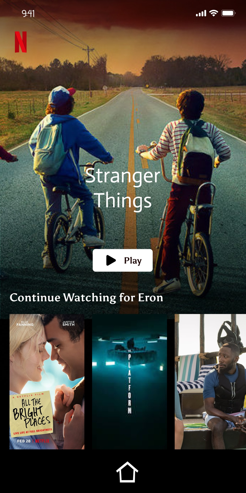

# 007_android_layout

## CÁC LAYOUT VÀ VIEWBINDING

- FrameLayout, RelativeLayout, ConstraintLayout.
- Cách sử dụng ViewBinding.

- Bài tập :
  - Dựng lại giao diện sau đây và push lên nhánh của mình tại [link](https://github.com/proptit-mobile-d22/007_basic_layout), [ảnh](https://www.figma.com/.../lUyr.../Netflix-App-(Community)...).
  - Sử dụng thư viện Glide để load ảnh vào vị trí 3 bộ phim.
- Lưu ý: Cố gắng làm responsive nhất có thể, chỉ yêu cầu fix cứng 3 item và dùng ScrollView, chưa cần tìm hiểu ListView hay RecyclerView.

  
