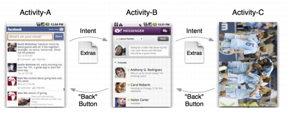
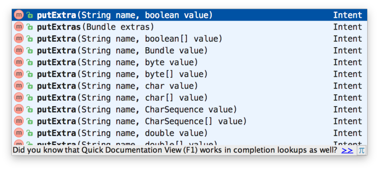
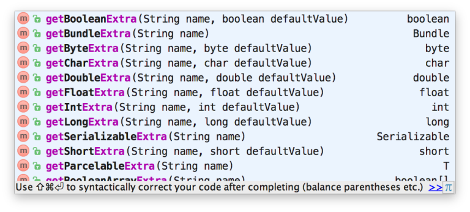
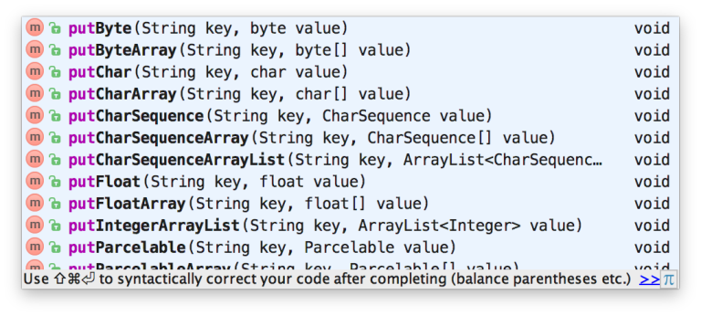
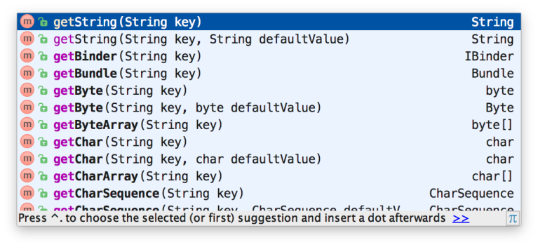

:memo: <span style="color:orange">MOBILE_008_ANDROID_ACTIVITY</span>

# ACTIVITY VÀ INTENT TRONG ANDROID


## Table of Content

- [ACTIVITY VÀ INTENT TRONG ANDROID](#activity-và-intent-trong-android)
  - [Table of Content](#table-of-content)
  - [I. Foreground, background application](#i-foreground-background-application)
    - [1. Foreground application](#1-foreground-application)
    - [2. Background application](#2-background-application)
    - [3. Các trạng thái ứng dụng](#3-các-trạng-thái-ứng-dụng)
  - [II. Activity, Context](#ii-activity-context)
    - [1. Activity](#1-activity)
      - [Khai báo Activity trong AndroidManifest](#khai-báo-activity-trong-androidmanifest)
      - [Vòng đời một Activity](#vòng-đời-một-activity)
    - [2. Context](#2-context)
      - [Application Context](#application-context)
      - [Activity Context](#activity-context)
  - [III. Intent](#iii-intent)
    - [1. Khái niệm](#1-khái-niệm)
      - [Đối tượng dữ liệu trong Intent](#đối-tượng-dữ-liệu-trong-intent)
      - [Sử dụng](#sử-dụng)
    - [2. Phân loại](#2-phân-loại)
      - [Explicit Intent – Intent dạng tường minh](#explicit-intent--intent-dạng-tường-minh)
      - [Implicit Intent – Intent không tường minh](#implicit-intent--intent-không-tường-minh)
  - [IV. Truyền dữ liệu giữa 2 Activity](#iv-truyền-dữ-liệu-giữa-2-activity)
    - [1. Extra](#1-extra)
      - [Gửi dữ liệu](#gửi-dữ-liệu)
      - [Nhận dữ liệu](#nhận-dữ-liệu)
    - [2. Bundle](#2-bundle)
      - [Gửi dữ liệu bằng Bundle](#gửi-dữ-liệu-bằng-bundle)
      - [Nhận dữ liệu bằng Bundle](#nhận-dữ-liệu-bằng-bundle)
  - [V. Multi-resume, onTopResumedActivityChanged()](#v-multi-resume-ontopresumedactivitychanged)

## I. Foreground, background application

### 1. Foreground application

> Ứng đang chạy, đang hiển thị cho người dùng thấy thì nó được gọi là foreground application.

- Nếu như trên máy tính, màn hình to, rộng nên có thể hiển thị cùng lúc nhiều cửa sổ / màn hình của nhiều ứng dụng. Trên mobile thì ứng dụng cũng được chạy song song nhưng vì màn hình nhỏ nên nó chỉ hiển thị 1 app vào 1 thời điểm. Ứng dụng này hiện đang nhận được sự chú ý và tương tác của người dùng, và nó có thể bao gồm một hoặc nhiều activity mà người dùng có thể nhìn thấy và tương tác.

- Đặc điểm của Foreground Application:
  - Visible (Hiển thị): Activity hoặc fragment của ứng dụng đang hiển thị và người dùng có thể thấy được.
  - User Interaction (Tương tác người dùng): Người dùng đang tương tác với ứng dụng, như nhấn nút, nhập văn bản, cuộn trang, v.v.
  - Active State (Trạng thái hoạt động): Ứng dụng đang chạy trong trạng thái hoạt động và không bị tạm dừng hoặc dừng lại.

### 2. Background application

> Là ứng dụng đang được chạy ngầm (chạy nền) bên trong hệ thống, người dùng không thấy nó.

- Tình huống thường xảy ra là, khi người dùng bấm nút Home (trên iphone, android) thì ứng dụng đó "đóng lại". Người dùng không thấy nó nhưng nó vẫn đang được chạy ngầm bên dưới. Ứng dụng đó vẫn đang chạy và có thể thực hiện các tác vụ nhất định trong nền. Các ứng dụng này không có bất kỳ activity nào hiển thị trên màn hình, nhưng chúng có thể đang thực hiện các công việc quan trọng như đồng bộ dữ liệu, kiểm tra cập nhật hoặc thực hiện các tác vụ thời gian dài khác.

- Đặc điểm của Background Application:
  - Invisible (Không hiển thị): Các activity của ứng dụng không hiển thị trên màn hình và người dùng không tương tác trực tiếp với chúng.
  - Limited Resources (Tài nguyên giới hạn): Android giới hạn các tài nguyên mà ứng dụng nền có thể sử dụng để tiết kiệm pin và tối ưu hóa hiệu suất hệ thống.
  - Background Tasks (Tác vụ nền): Ứng dụng có thể thực hiện các tác vụ nền như gửi thông báo, đồng bộ dữ liệu, hoặc thực hiện các công việc nền khác thông qua các dịch vụ (services), worker, hoặc alarm.

### 3. Các trạng thái ứng dụng

- Ứng dụng Android có thể ở một trong các trạng thái sau:
  - Foreground (Nền trước): Ứng dụng đang hiển thị và tương tác với người dùng.
  - Background (Nền sau): Ứng dụng vẫn đang chạy nhưng không hiển thị cho người dùng và có thể thực hiện các tác vụ nền.
  - Stopped (Dừng lại): Ứng dụng không còn chạy và không chiếm tài nguyên hệ thống.
  - Destroyed (Bị hủy): Ứng dụng hoặc activity bị hủy và phải được khởi tạo lại khi người dùng mở lại ứng dụng.

## II. Activity, Context

### 1. Activity

> Lớp **Activity** là thành phần quan trọng nhất của ứng dụng Android, cách mà chúng hoạt động tạo thành nền tảng cơ bản của mô hình lập trình ứng dụng.

- Android khởi chạy một ứng dụng thông thường bằng kích hoạt một Activity tương ứng với vòng đời cụ thể của nó trong quá trình hoạt động.
- Thường một Activity cung cấp một của sổ, ở đó ứng dụng sẽ dựng các thành phần UI (User Interface - giao diện người dùng). Mặc định cửa sổ này là đầy màn hình thiết bị, nhưng có một vài trường hợp riêng sẽ nhỏ hơn và nổi phía trên cửa sổ khác.
- Hầu hết các ứng dụng đều sử dụng nhiều màn hình khác nhau, có nghĩa nó sẽ phải có nhiều Activity khác nhau. Khi một Activity chỉ định là Activity chính, nó sẽ là màn hình đầu tiên khi khởi chạy ứng dụng. Một Activity này lại có thể gọi và kích hoạt một Activity khác. Ví dụ một Activity hiện thị danh sách các ghi chú, nó gọi một Activity khác để xem nội dung chi tiết của ghi chú.

  

  - Hình trên, ứng dụng khởi chạy với Activity - A, Activity - A kích hoạt Activity - B bằng Intent, Activity - B hoạt động có thể gọi Activity - C và khi bấm nút Back của điện thoạt Activity được gọi sẽ đóng và trở này Activity gọi nó.

#### Khai báo Activity trong AndroidManifest

- Để một **Activity** có thể mở ra được (chạy được) bằng phương thức `Context.startActivity()` hoặc khởi chạy khi mở ứng dụng thì phải khai báo nó trong `AndroidManifest.xml`.
- Mỗi **Activity** khai báo trong manifest đều nằm trong phần tử `application` với cú pháp.

  ```html
  <!-- .... --!>
    <activity android:name="lớp_Activity">
        <!-- các tham số con --!>
    </activity>
  <!-- .... --!>
  ```

- Ngoài thuộc tính `android:name` như trên, tùy thuộc mục đích còn có nhiều thuộc tính khác kế thừa từ Theme, hoặc được thiết lập trực tiếp như: `android:screenOrientation`, `android:label`, `android:icon`, `android:permission`...
- Để thiết lập Activity là Activity mặc định (chạy đầu tiên khi mở ứng dụng) thì thêm `intent-filter` như sau vào trong phần tử activity đó, ví dụ.

  ```html
  <!-- .... --!>
    <activity android:name="lớp_Activity">
        <intent-filter>
            <action android:name="android.intent.action.MAIN" />
            <category android:name="android.intent.category.LAUNCHER" />
        </intent-filter>
    </activity>
  <!-- .... --!>
  ```

- Khai báo Main Activity.

  ```html
  <activity 

    android:name="com.example.myapplication.MainActivity"

    android:configChanges="orientation|screenSize"

    android:exported="false"

    android:screenOrientation="landscape">

        <intent-filter>

            <action android:name="android.intent.action.MAIN" />

            <category android:name="android.intent.category.LAUNCHER" />

        </intent-filter>

  </activity>
  ```

#### Vòng đời một Activity

> Khi người dùng di chuyển qua, ra khỏi và quay lại ứng dụng, các thực thể Activity trong ứng dụng sẽ chuyển đổi qua nhiều trạng thái trong vòng đời của chúng. Lớp Activity cung cấp một số lệnh gọi lại cho hoạt động biết khi nào một trạng thái thay đổi hoặc hệ thống đang tạo, dừng hoặc tiếp tục một hoạt động hoặc huỷ bỏ quy trình chứa hoạt động đó.

- Mỗi lệnh gọi lại cho phép bạn thực hiện công việc cụ thể phù hợp với một sự thay đổi trạng thái nhất định. Việc thực hiện đúng công việc vào đúng thời điểm và xử lý quá trình chuyển đổi đúng cách sẽ giúp ứng dụng của bạn mạnh mẽ và hiệu suất hơn. Ví dụ: nếu triển khai tốt các phương thức gọi lại trong vòng đời, ứng dụng của bạn có thể tránh được những điều sau:
  - Sự cố khi người dùng nhận cuộc gọi điện thoại hoặc chuyển sang một ứng dụng khác trong khi dùng ứng dụng của bạn.
  - Tiêu thụ tài nguyên hệ thống có giá trị khi người dùng không chủ động sử dụng phần mềm đó.
  - Mất tiến trình của người dùng nếu họ rời khỏi ứng dụng và quay lại ứng dụng sau đó.
  - Sự cố hoặc mất tiến trình của người dùng khi màn hình xoay giữa hướng ngang và dọc.

- Để điều hướng quá trình chuyển đổi giữa các giai đoạn trong vòng đời hoạt động, lớp **Activity** cung cấp một tập hợp cốt lõi gồm 6 lệnh gọi lại: `onCreate()`, `onStart()`, `onResume()`, `onPause()`, `onStop()` và `onDestroy()`. Hệ thống sẽ gọi từng lệnh gọi lại này khi hoạt động chuyển sang trạng thái mới.

  

- Mô tả:
  1. Sơ đồ bắt đầu từ khi Activity launched, tức là khi Activity được kích hoạt, và được hệ thống đẩy vào BackStack. Sau khi kích hoạt, lần lượt các callback onCreate(), onStart(), onResume() sẽ được hệ thống gọi đến.
     - Sau khi gọi đến các callback trên, thì Activity mới chính thức được xem là đang chạy (Activity running).
  2. Lúc này, nếu có bất kỳ Activity nào khác chiếm quyền hiển thị, thì Activity hiện tại sẽ rơi vào trạng thái onPause().
     - Nếu sự hiển thị của Activity khác làm cho Activity mà chúng ta đang nói đến không còn nhìn thấy nữa thì onStop() sẽ được gọi ngay sau đó.
     - Nếu Acvitity đã vào onPause() rồi, tức là đang bị Activity khác đè lên, mà người dùng sau đó quay về lại Activity cũ, thì onResume() được gọi.
     - Còn nếu Activity đã vào onStop() rồi, mà người dùng quay về lại Activity cũ thì onRestart() được gọi.
  3. Trong cả hai trường hợp Activity rơi vào onPause() hoặc onStop(), nó sẽ rất dễ bị hệ thống thu hồi (tức là bị hủy) để giải phóng tài nguyên, khi này nếu quay lại Activity cũ, onCreate() sẽ được gọi chứ không phải onResume() hay onRestart().
  4. Và cuối cùng, nếu một Activity bị hủy một cách có chủ đích, chẳng hạn như người dùng nhấn nút Back ở System Bar, hay hàm finish() được gọi,… thì onDestroy() sẽ được kích hoạt và Activity kết thúc vòng đời của nó.

- Các trạng thái chính trong Activity Lifecycle
  - **Active/Running**: Khi activity ở foreground và đang tương tác trực tiếp với user.
  - **Pause**: Activity không thể tương tác nhưng vẫn được nhìn thấy (bị che khuất không toàn toàn bởi một Activity khác)
  - **Stop/Hidden**: Activity bị che khuất hoàn toàn bởi một Activity khác, vẫn có thể lưu trữ thông tin những sẽ bị ưu tiên xóa bỏ nếu hệ thống thiếu bộ nhớ
  - **Destroy**: Khi gọi tới hàm finish() hoặc bị hệ thống xóa bỏ

- Các callback quá trình hoạt động của Activity.
  - `onCreate(Bundle savedInstanceState)`: Được gọi khi hoạt động mới được tạo, tại đây khởi tạo các biến, nạp giao diện layout ..., phương thức này cũng nhận dữ liệu lưu lại trạng thái hoạt động trước đó (với mục đích để phục hồi - savedInstanceState). Sau sự kiện này bao giờ cũng gọi ngay lập tức `onStart()`.
  - `onStart()`: Được gọi ngay trước khi Activity hiển thị trên màn hình.
  - `onResume()`: Được gọi ngay khi Activity bắt đầu có thể tương tác với người dùng, và Activity nằm trên cùng trong danh sách các Activity của hệ thống. Sau phương thức này là các chức năng của Activity hoạt động dựa trên tương tác của người dùng ..., cho đến khi có một nguyên nhân nào đó mà phương thức OnPause được gọi.
  - `onPause()`: Được gọi khi hệ thống sắp kích hoạt một Activity khác, nếu bạn quá tải phương thức này, thường để lưu lại dự liệu thật nhanh để hệ thống còn kích hoạt Activity khác. Ngay sau phương thức này nó sẽ gọi `onResume()` nếu Activity được kích hoạt lại ngay, hoặc gọi `onStop()` nếu Activity bị ẩn đi.
  - `onStop()`: Được gọi khi nó bị ẩn đi. Sau phương thức này, Activity có thể gọi `onRestart()` nếu nó được người dùng kích hoạt lại hoặc gọi `onDestroy()` để hết thúc.
  - `onDestroy()`: gọi khi Activity bị hủy hoàn toàn (ví dụ gọi finish(), hoặc người dùng kill Activity)

:bulb: Activity BackStack

> Task là tập hợp gồm nhiều activity mà người dùng tương tác với ứng dụng khi thực hiện một công việc nhất định.

- Các activity được sắp xếp trong một stack (được gọi là BackStack), theo thứ tự mở của mỗi activity.

### 2. Context

> Context là thành phần trong ứng dụng android cung cấp quyền truy cập thông tin về các trạng thái của ứng dụng đó.

- Nó cung cấp các Activities, Fragments và Services truy cập tới các file tài nguyên, hình ảnh, theme, style và các file nằm ngoài ứng dụng.
- Nó cũng cho phép truy cập vào các thành phần chính của Android như layout, keyboard và tìm kiếm các content providers.

  

- Có 2 loại context.

#### Application Context

- Nó là một thể hiện, là singleton và có thể được truy cập trong activity thông qua getApplicationContext().
- Application Context được gắn với vòng đời của một ứng dụng.
- Application context có thể được sử dụng khi bạn cần một context có vòng đời của nó tách biệt với context hiện tại hoặc khi bạn đang chuyển một context vượt ra ngoài phạm vi của activity.
- Ví dụ: Nếu phải tạo một đối tượng singleton cho ứng dụng của mình và đối tượng đó cần một ngữ cảnh, hãy luôn sử dụng Application Context.
  - Nếu sử dụng Activity Context ở đây, nó sẽ dẫn đến rò rỉ bộ nhớ vì nó sẽ giữ tham chiếu đến activity và activity này sẽ không bị GC thu dọn.
  - Trong trường hợp, khi phải khởi tạo thư viện trong một activity, hãy sử dụng application context thay cho activity context.
- Sử dụng getApplicationContext () khi cần một context cho một thứ có thể tồn tại lâu hơn bất kỳ context nào khác.

#### Activity Context

- Mỗi activity sẽ có context của riêng nó. Contex tnày được gắn với vòng đời của activity.
- Activity context nên được sử dụng khi bạn đang ở trong phạm vi của activity hoặc bạn cần context có vòng đời được gắn với ngữ cảnh hiện tại.
- Ví dụ: Nếu phải tạo một đối tượng có vòng đời được gắn với một activity, có thể sử dụng activity context.
- Khi đang ở trong 1 Activity, context gần nhất là Activity context. → Lấy bằng phương thức getContext () trong ContentProvider.

:bulb: Sử dụng sai context có thể dẫn đến rò rỉ bộ nhớ (Memory leaks) trong một ứng dụng Android.

## III. Intent

### 1. Khái niệm

- Intents là một thành phần quan trọng trong android. Nó cho phép các thành phần ứng dụng có thể yêu cầu các hàm từ các thành phần ứng dụng android khác. Ví dụ một activity có thể chạy một activity khác ở bên ngoài để chụp ảnh.
- Intents là một objects của android.content.Intent. Intents sẽ được gửi đến hệ thống android để xác định hành động bạn muốn thực hiện, đối tượng bạn muốn xử lý.

#### Đối tượng dữ liệu trong Intent

- Đối tượng dữ liệu của Intent là một cấu trúc dữ liệu được dùng bởi các component trong ứng dụng hoặc hệ thống nhận được và có những xử lý thích hợp.
Đối tượng dữ liệu của Intent có thể chứa các thuộc tính sau dựa vào cách mà các component muốn tương tác hoặc thực hiện một tác vụ thích hợp:

- Các thuộc tính chính
  - Action
    - Tên của các action mà Intent sẽ được thực hiện.
    - Action có thể được định nghĩa sẵn Android cung cấp hoặc do người lập trình tự định nghĩa cho riêng ứng dụng (như dùng trong BroadcastReceiver, sẽ giới thiệu trong bài tiếp theo).
  - Data
    - Dữ liệu mà thành phần được gọi (activity, service,…) sẽ xử lý.
    - Được định dạng là đối tượng URI (tham khảo class Uri class).
    - Data truyền vào sẽ được xử lý và hành động tùy theo theo “the MIME type” mà dữ liệu sử dụng.
- Các thuộc tính tùy chọn
  - Category
    - Là chuỗi ký tự chứa thông tin về nhóm phân loại các đối tường để xử lý các intent.
    - Có 2 category thông dụng thường được thấy trong các file manifest:
      - CATEGORY_BROWSABLE: Cho phép start một activity bằng Web browser để hiện thị dữ liệu định dạng là một liên kết ví dụ như một e-mail hay một bức hình trên mạng.
      - CATEGORY_LAUNCHER: Khai báo để chỉ định activity sẽ được start khi bắt đầu mở ứng dụng.
  - Extras
    - Chứa tất cả các cặp key-value pairs chứa các thông tin dữ liệu bổ sung truyền qua.
    - Thông số extras sẽ được gán và đọc bằng phương thức putExtras()/getExtras() methods tương ứng với thông số là đối tượng có cấu trúc Bundle.
  - Flags
    - Những giá trị của flag này sẽ hướng dẫn có hệ thống Android cách để start một activity và kết thúc một activity.

#### Sử dụng

- Intents có thể được sử dụng để:
  - Mở một Activity mới và truyền dữ liệu cho Activity đó
  - Mở một Fragments / Giao tiếp giữa các Fragments.
  - Mở hoặc dừng một Service
  - Hoặc có thể gọi một Activity bằng Broadcast Receiver

### 2. Phân loại

#### Explicit Intent – Intent dạng tường minh

- `Intent tường minh` tức là khi tạo một đối tượng Intent, chúng ta chỉ định rõ và truyền trực tiếp tên thành phần đích vào intent.
- Ví dụ: như đoạn code bên dưới, intent được chỉ định rõ OtherActivity sẽ là thành phần nhận và xử lý intent này.

  ```kotlin
  val intent = Intent(this, OtherActivity::class.java)
  startActivity(intent)
  ```

#### Implicit Intent – Intent không tường minh

- - Thay vì trong intent Android được chỉ định sẵn một Activity nào đó thực hiện, thì sẽ chỉ truyền vào action và gửi cho Android. Android sẽ dựa vào action đó mà lọc những thành phần nào đã đăng kí action đó gọi ra.
- Vì vậy, Android có thể tự động kích hoạt thành phần từ cùng một ứng dụng hoặc một số ứng dụng khác để xử lý intent đó.
- Ví dụ, chúng ta cần phải hiển thị một vị trí lên bản đồ. Thay vì chúng ta phải mã hóa và viết hẳn module bản đồ để hiển thị thì có thể gửi vị trí đó vào intent, rồi Android sẽ tự tìm xem có ứng dụng nào phù hợp( như [Google Map](https://www.google.com/maps) chẳng hạn) để hiển thị nó.
- Thông thường, chúng ta dùng các `intent tường minh` để kích hoạt các thành phần trong ứng dụng, còn `intent không tường minh` để chạy các thành phần của ứng dụng bên thứ 3.
- Đây là một đoạn code minh họa cho `intent không tường minh`( sử dụng ACTION_VIEW để gọi ứng dụng nào có thể hiển thị được link)

  ```kotlin
  class ImplicitIntentActivity : AppCompatActivity() {
 
    override fun onCreate(savedInstanceState: Bundle?) {
        super.onCreate(savedInstanceState)
        setContentView(R.layout.activity_implicit_intent)
    }
 
    fun showWebPage(view: View) {
        val intent = Intent(Intent.ACTION_VIEW,
                Uri.parse("http://www.ebookfrenzy.com"))
 
        startActivity(intent)
    }
  }
  ```

## IV. Truyền dữ liệu giữa 2 Activity

- Chỉ có duy nhất một cách để truyền dữ liệu qua lại giữa các Activity. **Đó là cách “nhét” dữ liệu vào Intent và nhờ thành phần này chuyển giúp.** Hệ thống sẽ đảm bảo dữ liệu được gửi qua “nguyên vẹn” và kịp thời ở Activity mới.
- Dữ liệu được “nhét” vào trong Intent và được lấy ra khỏi Intent theo các cặp dữ liệu dạng key/value. Key ở đây là một chuỗi, giúp định danh cho dữ liệu value. Nếu để vào trong Intent cặp key/value nào, thì phải lấy ra bởi cặp key/value đó, phải đảm bảo khai báo đúng key và lấy ra đúng kiểu dữ liệu của value khi để vào.
- Tuy có một cách, nhưng có thể sử dụng một trong hai hình thức sau. Một là sử dụng Extra, hoặc sử dụng Bundle.

### 1. Extra

- Có thể nói, truyền nhận dữ liệu bằng Extra là cách dễ nhất.

#### Gửi dữ liệu

- Để gửi dữ liệu bằng Extra, sau khi khai báo Intent và trước khi dùng nó để kích hoạt activity nào đó, có thể sử dụng các phương thức được nạp chồng của nó để gửi dữ liệu. Các phương thức đó có chung một tên là putExtra().

  

  - Với mỗi putExtra() như vậy, tham số đầu tiên chính là key. Tham số thứ hai tương tự chính là value.

  ```java
  Intent intent = new Intent(this, ContactActivity.class);
  intent.putExtra("Key_1", "Truyền một String");  // Truyền một String
  intent.putExtra("Key_2", 5);                    // Truyền một Int
  intent.putExtra("Key_3", true);                 // Truyền một Boolean
  startActivity(intent);
  ```

#### Nhận dữ liệu

- Khi này, theo như ví dụ trên thì ContactActivity sẽ được kích hoạt với dữ liệu là ba cặp key/value được truyền qua. Ở phương thức onCreate() hoặc bất cứ chỗ nào của ContactActivity, đều có thể lấy bất cứ cặp key/value nào ra dùng bằng cách gọi đến getXxxExtra().

  

  - Tham số `name truyền vào phương thức này phải đúng là *key* bên đóng gói.
- Một số phương thức cần phải có tham số thứ hai, tham số này chính là dữ liệu mặc định nếu như hệ thống không tìm thấy dữ liệu với *key* cung cấp. Việc cung cấp tham số thứ hai này tránh một số lỗi xảy ra đối với chương trình.
- Đoạn code sau minh họa cách lấy dữ liệu ra khỏi *Intent* bằng *Extra* ở `onCreate()` của Activity.

  ```java
  @Override
  protected void onCreate(Bundle savedInstanceState) {
    super.onCreate(savedInstanceState);
    setContentView(R.layout.activity_contact);
  
    // Các dòng code khác...
  
    Intent intent = getIntent();
    String value1 = intent.getStringExtra("Key_1");
    int value2 = intent.getIntExtra("Key_2", 0);
    boolean value3 = intent.getBooleanExtra("Key_3", false);
  }
  ```

### 2. Bundle

- Thực ra Bundle và Extra không khác gì nhau hết. Nếu như Extra sẽ “xé lẻ” dữ liệu ra và gửi theo từng dòng. Thì Bundle sẽ giúp “đóng gói” dữ liệu lại và gửi nguyên kiện. Bundle sẽ tiện hơn trong trường hợp muốn gửi cùng một bộ dữ liệu đến nhiều Activity khác nhau.

#### Gửi dữ liệu bằng Bundle

- Đầu tiên là dòng tạo ra Bundle, sau đó vẫn là các dòng đặt dữ liệu vào Bundle, các dòng này có hơi khác với các dòng đặt dữ liệu vào Extra một chút, nếu với Extra dùng các phương thức nạp chồng với cùng một tên putExtra() thì với Bundle phải dùng đúng phương thức putXxx() với Xxx là kiểu dữ liệu cần dùng.

  

- Khi Bundle đã chứa đủ dữ liệu, cần phải đặt Bundle này vào trong Intent bằng một dòng code putExtras()

  ```java
  Intent intent = new Intent(this, ContactActivity.class);
  Bundle bundle = new Bundle();
  bundle.putString("Key_1", "Truyền một String"); // Truyền một String
  bundle.putInt("Key_2", 5);                      // Truyền một Int
  bundle.putBoolean("Key_3", true);               // Truyền một Boolean
  intent.putExtras(bundle);
  startActivity(intent);
  ```

#### Nhận dữ liệu bằng Bundle

- Bên nhận cũng sẽ nên nhận theo Bundle trước rồi mới lấy từng dữ liệu ra dùng. Để lấy Bundle ra khỏi Intent thì chúng ta có phương thức getExtras().
- Sau khi lấy Bundle ra khỏi Intent, việc tiếp theo sẽ gọi đến các phương thức getXxx() của nó. Các phương thức này của Bundle cũng giống như các phương thức getXxxExtra() của Extra trên kia. Chỉ khác một chỗ getXxx() của Bundle thường có hai phương thức nạp chồng, linh động hơn. Thường thì nên dùng getXxx() với hai tham số, như vậy có thể định nghĩa được giá trị mặc định cho từng phương thức khi mà nó không tìm thấy dữ liệu từ key cung cấp, giúp tránh một số lỗi không cần thiết.

  

- Để chắc chắn thì khi nhận dữ liệu với Bundle, nên kiểm tra xem Bundle đó có tồn tại hay không (kiểm tra khác null) trước.
  
  ```java
  @Override
  protected void onCreate(Bundle savedInstanceState) {
    super.onCreate(savedInstanceState);
    setContentView(R.layout.activity_contact);
  
    // Các dòng code khác...
  
    Intent intent = getIntent();
    Bundle bundle = intent.getExtras();
    if (bundle != null) {
        String value1 = bundle.getString("Key_1", "");
        int value2 = bundle.getInt("Key_2", 0);
        boolean value3 = bundle.getBoolean("Key_3", false);
    }
  }
  ```

## V. Multi-resume, onTopResumedActivityChanged()
