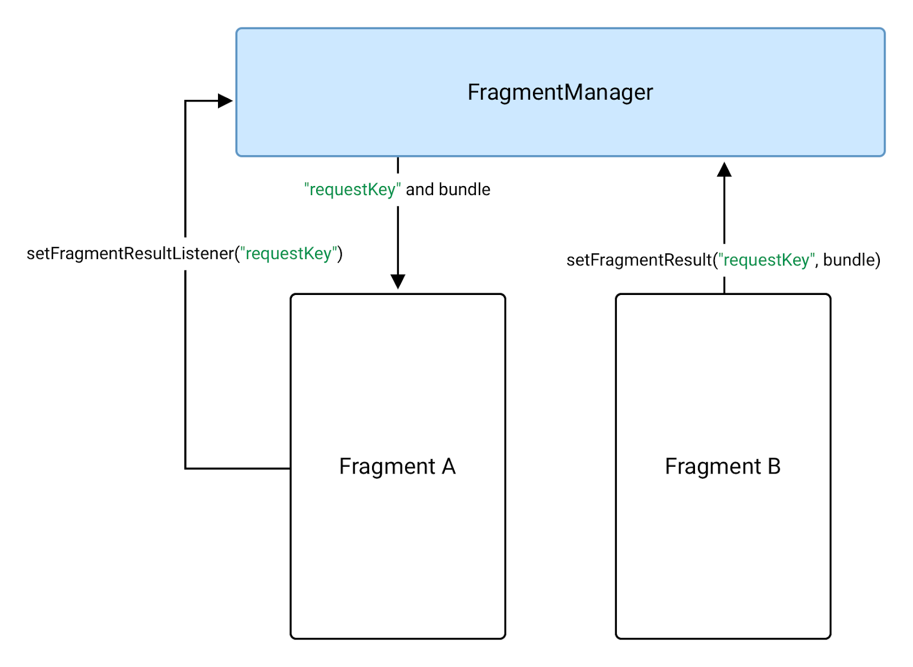

:memo: <span style="color:orange">MOBILE_009_ANDROID_FRAGMENT</span>

# FRAGMENT TRONG ANDROID


## Table of Content

- [FRAGMENT TRONG ANDROID](#fragment-trong-android)
  - [Table of Content](#table-of-content)
  - [I. Fragment](#i-fragment)
    - [1. Fragment](#1-fragment)
    - [2. Fragment Manager](#2-fragment-manager)
    - [3. FragmentTransaction](#3-fragmenttransaction)
  - [II. Fragment Lifecycle](#ii-fragment-lifecycle)
  - [III. Giao tiếp Fragment](#iii-giao-tiếp-fragment)
    - [1. Chia sẻ dữ liệu sử dụng ViewModel](#1-chia-sẻ-dữ-liệu-sử-dụng-viewmodel)
      - [Chia sẻ dữ liệu với hoạt động của máy chủ lưu trữ](#chia-sẻ-dữ-liệu-với-hoạt-động-của-máy-chủ-lưu-trữ)
      - [Chia sẻ dữ liệu giữa các Fragment](#chia-sẻ-dữ-liệu-giữa-các-fragment)
      - [Chia sẻ dữ liệu giữa parent fragment và child fragment](#chia-sẻ-dữ-liệu-giữa-parent-fragment-và-child-fragment)
    - [2. Nhận kết quả bằng Fragment Result API](#2-nhận-kết-quả-bằng-fragment-result-api)
      - [Chuyển dữ liệu giữa các fragment](#chuyển-dữ-liệu-giữa-các-fragment)
      - [Chuyển dữ liệu giữa parent fragment và child fragment](#chuyển-dữ-liệu-giữa-parent-fragment-và-child-fragment)

## I. Fragment

### 1. Fragment

> **Fragment** thể hiện phần giao diện người dùng có thể tái sử dụng của ứng dụng.

- Mỗi fragment xác định và quản lý bố cục riêng, có vòng đời riêng và có thể xử lý các sự kiện đầu vào riêng.
- Các fragment không thể tồn tại độc lập mà phải được một **activity** hoặc **fragment** khác lưu trữ.
- Các fragment cho phép ta chia giao diện người dùng thành các phần riêng biệt, từ đó giao diện được phân chia theo module và có thể tái sử dụng.
- Các Activity là vị trí lý tưởng để đặt các phần tử chung xung quanh giao diện người dùng, ví dụ như thanh điều hướng. Ngược lại, các fragment phù hợp hơn để xác định và quản lý giao diện người dùng của một màn hình hoặc một phần màn hình.
→ Activity phụ trách hiện thị giao diện điều hướng, còn fragment để hiển thị bố cục phù hợp.

  

:bulb:Fragment được giới thiệu trong phiên bản Android 3.0 Honeycomb (API level 11).

- Để tạo 1 fragement, chuột phải vào folder chứa mainActivity → chọn fragment.
- Ngoài ra thư viện còn có các lớp fragment đặc biệt như DialogFragment,…

### 2. Fragment Manager

> **FragmentManager** là class chịu trách nhiệm thực hiện hành động trên các fragment của ứng dụng.

- Ví dụ: thêm, xoá hoặc thay thế fragment, cũng như thêm fragment vào ngăn xếp lui.
- FragmentActivity và các subclass của nó, chẳng hạn như AppCompatActivity, có quyền truy cập vào FragmentManager thông qua phương thức getSupportFragmentManager().

  ```kotlin
  FragmentManager fragmentManager = getFragmentManager();
  ```

- 1 fragment có thể lưu trữ 1 hay nhiều fragment con. Fragment con có thể được tham chiếu tới nhờ getChildFragmentManager(). Ngược lại, fragment con có thể truy cập fragment cha nhờ getParentFragmentManager().
- FragmentManager quản lý **BackStack** của fragment. Trong thời gian chạy, FragmentManager có thể thực hiện các thao tác như thêm hoặc xoá các fragment để phản hồi tương tác của người dùng. Mỗi tập hợp thay đổi được xác nhận cùng nhau dưới dạng một đơn vị duy nhất gọi là FragmentTransaction.
- Ví dụ khi người dùng nhấn nút quay lại trên thiết bị, ta sẽ dùng FragmentManager.popBackStack() để có thể pop đi fragment hiện tại, quay lại fragment cũ. Ngược lại addToBackStack() để thêm 1 fragment và Backstack.

### 3. FragmentTransaction

- Trong thời gian chạy, FragmentManager có thể thêm, xoá, thay thế và thực hiện các thao tác khác với các fragment (fragment) để phản hồi khi người dùng tương tác. Mỗi tập hợp thay đổi fragment mà bạn xác nhận (commit) được gọi là một giao dịch (transaction) và bạn có thể chỉ định việc cần làm bên trong giao dịch bằng cách sử dụng các API mà lớp FragmentTransaction cung cấp.
  
  ```kotlin
  val fragmentManager = ...
  val fragmentTransaction = fragmentManager.beginTransaction()
  ```

- Để hiển thị một fragment trong vùng chứa bố cục, sử dụng FragmentManager để tạo một FragmentTransaction. Sau đó, trong giao dịch, có thể thực hiện thao tác add() hoặc replace() trên vùng chứa.

  ```kotlin
  supportFragmentManager.commit {
   replace<ExampleFragment>(R.id.fragment_container)
   setReorderingAllowed(true)
   addToBackStack("name") // Name can be null
  }
  ```

- Lệnh gọi cuối cùng trên mỗi FragmentTransaction phải là commit() → Báo hiệu cho FragmentManager rằng tất cả thao tác (operation) đã được thêm vào giao dịch.

  ```kotlin
  val fragmentManager = ...
  // The fragment-ktx module provides a commit block that automatically
  // calls beginTransaction and commit for you.
  fragmentManager.commit {
    // Add operations here
  }
  ```

  ```java
  FragmentTransaction fragmentTransaction = fragmentManager.beginTransaction();
  fragmentTransaction.add(R.id.ui_container, new MyListFragment());
  Fragment fragment = fragmentManager.findFragmentById(R.id.details_fragment);
  fragmentTransaction.remove(fragment);
  String tag = null;
  fragmentTransaction.addToBackStack(tag);
  fragmentTransaction.commit();
  ```

## II. Fragment Lifecycle

> Mỗi phiên bản Fragment đều có vòng đời riêng. Khi một người dùng điều hướng và tương tác với ứng dụng, các fragment sẽ dịch chuyển qua các trạng thái khác nhau của vòng đời khi chúng được thêm, xoá, xuất hiện hoặc thoát khỏi màn hình.

- Để quản lý vòng đời, `Fragment` thực hiện `LifecycleOwner`, hiển thị một đối tượng `Lifecycle` có thể được truy cập bằng phương thức `getLifecycle()`.
- Các trạng thái `Lifecycle` được biểu thị trong enum `Lifecycle.State`:
  - `INITIALIZED`
  - `CREATED`
  - `STARTED`
  - `RESUMED`
  - `DESTROYED`


- Các callback:
  - **`onAttach()`**: Fragment được đính kèm vào activity. Mỗi Fragment muốn chạy được thì nó phải thuộc vào một activity nào đó.
  - **`onCreate()`**: Khi một fragment mới được khởi tạo (hàm này luôn được gọi sau khi fragment được attach vào Activity)
  - **`onCreateView()`**: Thực hiện tạo giao diện (View), trả về View là giao diện file xml tương ứng Fragment. Ta không nên tương tác với Activity trong hàm này bởi vì Activity chưa được khởi tạo đầy đủ.
  - **`onActivityCreated()`**: Khi activity của fragment đã xong bước khởi tạo và attach vào Activity.
  - **`onStart()`**: Khi fragment hiển thị. Một fragment chỉ start sau khi Activity start và thường là nó start ngay lập tức khi Activity start xong
  - **`onResume()`**: Khi fragment hiển thị và có thể tương tác
  - **`onPause()`**: Khi fragment không còn tương tác (Có thể vẫn hiển thị). Điều này xảy ra ngay cả khi fragment bị gỡ bỏ hoặc bị thay thế, hoặc là khi activity của fragment bị tạm dừng.
  - **`onStop()`**: Khi fragment không còn hiển thị. Điều này xảy ra ngay sau khi fragment bị gỡ bỏ hoặc thay thế, hoặc là khi activity của fragment bị tạm dừng.
  - **`onDestroyView()`**: Khi các view hay resource được tạo trong onCreateView bị remove khỏi activity và destroy
  - **`onDestroy()`**: Khi fragment kết thúc việc dọn dẹp.
  - **`onDetach()`**: Khi fragment bị tách khỏi Activity của nó.

- Fragment phải được đưa vào một Activity do vòng đời của Fragment đó sẽ luôn luôn bị ảnh hưởng bởi vòng đời của Activity.


## III. Giao tiếp Fragment

> Thư viện Fragment cung cấp 2 lựa chọn giao tiếp: ViewModel dùng chung và Fragment Result API. Lựa chọn khuyên dùng phụ thuộc vào trường hợp sử dụng. Để chia sẻ dữ liệu ổn định với các API tuỳ chỉnh, hãy dùng ViewModel. Nếu muốn nhận được kết quả dùng một lần với dữ liệu có thể đặt trong Bundle, hãy dùng Fragment Result API.

### 1. Chia sẻ dữ liệu sử dụng ViewModel

- ViewModel là lựa chọn lý tưởng khi cần chia sẻ dữ liệu giữa nhiều fragment hoặc giữa các fragment và hoạt động của máy chủ lưu trữ (host activity). Các đối tượng ViewModel lưu trữ và quản lý dữ liệu giao diện người dùng.

#### Chia sẻ dữ liệu với hoạt động của máy chủ lưu trữ

- Trong một số trường hợp, bạn cần chia sẻ dữ liệu giữa các fragment và hoạt động của máy chủ lưu trữ.
- Sử dụng `ItemViewModel`.

  ```kotlin
  class ItemViewModel : ViewModel() {
    private val mutableSelectedItem = MutableLiveData<Item>()
    val selectedItem: LiveData<Item> get() = mutableSelectedItem

    fun selectItem(item: Item) {
        mutableSelectedItem.value = item
    }
  }
  ```

- Dữ liệu đã lưu trữ được gói trong một lớp MutableLiveData. LiveData là một lớp phần tử giữ dữ liệu có thể ghi nhận được và nhận biết vòng đời. MutableLiveData cho phép thay đổi giá trị của lớp đó.
- Fragment của bạn và Activity đều truy cập đến cùng 1 instance của ViewModel (cùng phạm vi hoạt động - phạm vi hoạt động của ViewModel được khởi tạo bằng cách truyền activity vào constructor của ViewModelProvider). ViewModelProvider xử lý việc khởi tạo ViewModel hoặc truy xuất đến nó nếu nó đã tồn tại. Cả Fragment và Activity đều có thể quan sát và sửa đổi dữ liệu trong ViewModel.

  ```kotlin
  class MainActivity : AppCompatActivity() {
    // Using the viewModels() Kotlin property delegate from the activity-ktx
    // artifact to retrieve the ViewModel in the activity scope.
    private val viewModel: ItemViewModel by viewModels()
    override fun onCreate(savedInstanceState: Bundle?) {
        super.onCreate(savedInstanceState)
        viewModel.selectedItem.observe(this, Observer { item ->
            // Perform an action with the latest item data.
        })
    }
  }

  class ListFragment : Fragment() {
    // Using the activityViewModels() Kotlin property delegate from the
    // fragment-ktx artifact to retrieve the ViewModel in the activity scope.
    private val viewModel: ItemViewModel by activityViewModels()

    // Called when the item is clicked.
    fun onItemClicked(item: Item) {
        // Set a new item.
        viewModel.selectItem(item)
    }
  }
  ```

#### Chia sẻ dữ liệu giữa các Fragment

- Những fragment này có thể chia sẻ một ViewModel bằng cách sử dụng phạm vi hoạt động của chúng để xử lý quá trình giao tiếp. Khi chia sẻ ViewModel theo cách này, các fragment không nhất thiết phải biết về nhau và hoạt động không cần phải làm gì để hỗ trợ quá trình giao tiếp.

  ```kotlin
  class ListViewModel : ViewModel() {
    val filters = MutableLiveData<Set<Filter>>()

    private val originalList: LiveData<List<Item>>() = ...
    val filteredList: LiveData<List<Item>> = ...

    fun addFilter(filter: Filter) { ... }

    fun removeFilter(filter: Filter) { ... }
  }

  class ListFragment : Fragment() {
    // Using the activityViewModels() Kotlin property delegate from the
    // fragment-ktx artifact to retrieve the ViewModel in the activity scope.
    private val viewModel: ListViewModel by activityViewModels()
    override fun onViewCreated(view: View, savedInstanceState: Bundle?) {
        viewModel.filteredList.observe(viewLifecycleOwner, Observer { list ->
            // Update the list UI.
        }
    }
  }

  class FilterFragment : Fragment() {
    private val viewModel: ListViewModel by activityViewModels()
    override fun onViewCreated(view: View, savedInstanceState: Bundle?) {
        viewModel.filters.observe(viewLifecycleOwner, Observer { set ->
            // Update the selected filters UI.
        }
    }

    fun onFilterSelected(filter: Filter) = viewModel.addFilter(filter)

    fun onFilterDeselected(filter: Filter) = viewModel.removeFilter(filter)
  }
  ```

#### Chia sẻ dữ liệu giữa parent fragment và child fragment

- Để chia sẻ dữ liệu giữa các fragment này, hãy dùng parent fragment làm phạm vi ViewModel.

  ```kotlin
  class ListFragment: Fragment() {
    // Using the viewModels() Kotlin property delegate from the fragment-ktx
    // artifact to retrieve the ViewModel.
    private val viewModel: ListViewModel by viewModels()
    override fun onViewCreated(view: View, savedInstanceState: Bundle?) {
        viewModel.filteredList.observe(viewLifecycleOwner, Observer { list ->
            // Update the list UI.
        }
    }
  }

  class ChildFragment: Fragment() {
    // Using the viewModels() Kotlin property delegate from the fragment-ktx
    // artifact to retrieve the ViewModel using the parent fragment's scope
    private val viewModel: ListViewModel by viewModels({requireParentFragment()})
    ...
  }
  ```

### 2. Nhận kết quả bằng Fragment Result API

- Trong một số trường hợp, bạn có thể cần chuyển giá trị dùng một lần giữa 2 fragment hoặc giữa một fragment và hoạt động của máy chủ lưu trữ.
- Trong Fragment phiên bản 1.3.0 trở lên, mỗi FragmentManager sẽ triển khai FragmentResultOwner. Việc này đồng nghĩa rằng FragmentManager có thể đóng vai trò là kho lưu trữ trung tâm cho các fragment result. Thay đổi này cho phép các thành phần giao tiếp với nhau bằng cách đặt fragment result và theo dõi nó mà không yêu cầu các thành phần tham chiếu trực tiếp với nhau.

#### Chuyển dữ liệu giữa các fragment

- Để chuyển dữ liệu từ fragment B trở về fragment A, trước tiên hãy đặt trình nghe xử lý kết quả trên fragment A là fragment nhận kết quả. Gọi hàm setFragmentResultListener() trên FragmentManager của fragment A như trong ví dụ.

  ```kotlin
  override fun onCreate(savedInstanceState: Bundle?) {
    super.onCreate(savedInstanceState)
    // Use the Kotlin extension in the fragment-ktx artifact.
    setFragmentResultListener("requestKey") { requestKey, bundle ->
        // We use a String here, but any type that can be put in a Bundle is supported.
        val result = bundle.getString("bundleKey")
        // Do something with the result.
    }
  }
  ```

  

- Trong fragment B (fragment tạo ra kết quả), hãy đặt kết quả trên cùng FragmentManager bằng cách sử dụng cùng một requestKey. Có thể thực hiện việc này thông qua API setFragmentResult().

  ```kotlin
  button.setOnClickListener {
    val result = "result"
    // Use the Kotlin extension in the fragment-ktx artifact.
    setFragmentResult("requestKey", bundleOf("bundleKey" to result))
  }
  ```

- Sau đó, ragment A sẽ nhận được kết quả và thực thi lệnh gọi lại trình xử lý nếu fragment là STARTED.
- Chỉ có thể sở hữu một trình nghe và kết quả cho một khóa nhất định. Nếu gọi setFragmentResult() nhiều lần cho cùng một khóa và nếu trình xử lý không phải là STARTED, hệ thống sẽ thay thế mọi kết quả đang chờ xử lý bằng kết quả đã cập nhật.

#### Chuyển dữ liệu giữa parent fragment và child fragment

- Để chuyển một kết quả giữa child fragment và parent fragment, parent fragment nên sử dụng getChildFragmentManager() khi gọi setFragmentResultListener().

  ```kotlin
  override fun onCreate(savedInstanceState: Bundle?) {
    super.onCreate(savedInstanceState)
    // Set the listener on the child fragmentManager.
    childFragmentManager.setFragmentResultListener("requestKey") { key, bundle ->
        val result = bundle.getString("bundleKey")
        // Do something with the result.
    }
  }
  ```

  

- Child fragment đặt kết quả trên FragmentManager. Sau đó, parent fragment sẽ nhận được kết quả khi nó là phân mảnh STARTED.

  ```kotlin
  button.setOnClickListener {
    val result = "result"
    // Use the Kotlin extension in the fragment-ktx artifact.
    setFragmentResult("requestKey", bundleOf("bundleKey" to result))
  }
  ```
