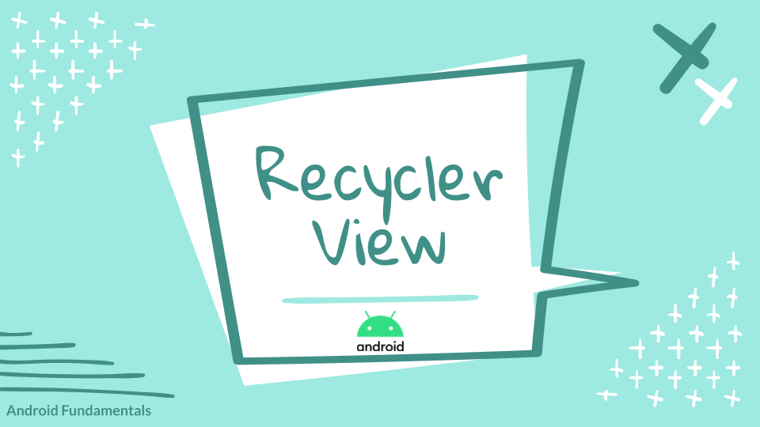
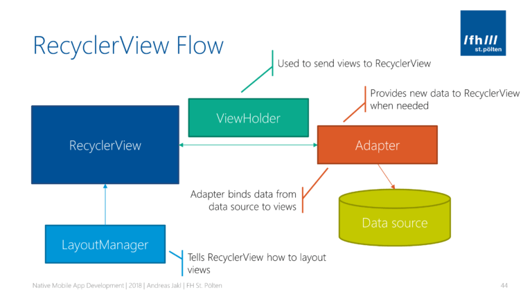
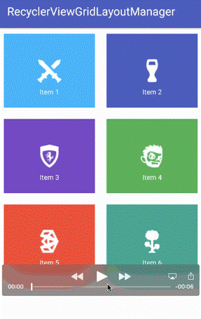
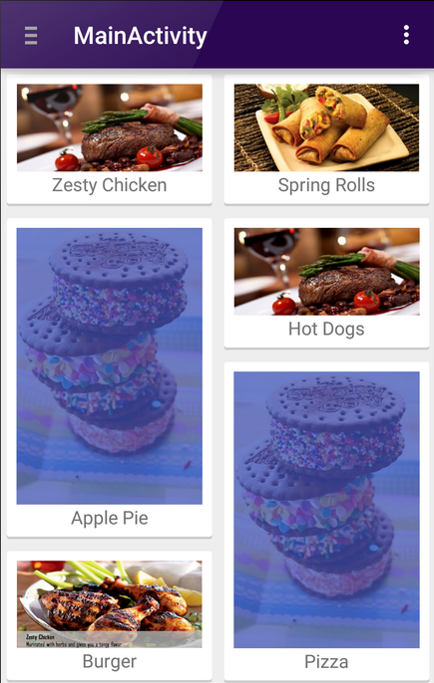
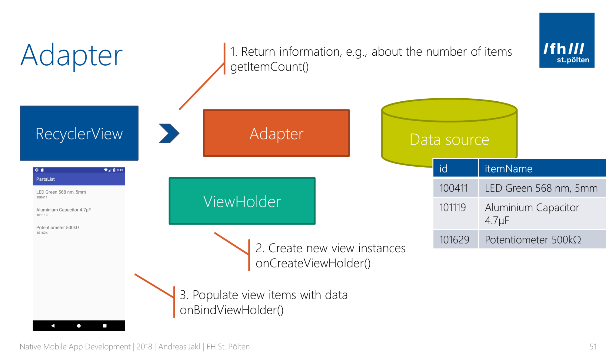

:memo: <span style="color:orange">MOBILE_010_ANDROID_RECYCLER_VIEW</span>

# RECYCLER VIEW TRONG ANDROID



## Table of Content

- [RECYCLER VIEW TRONG ANDROID](#recycler-view-trong-android)
  - [Table of Content](#table-of-content)
  - [I. Recycler View](#i-recycler-view)
    - [1. Overview](#1-overview)
    - [2. Các thành phần](#2-các-thành-phần)
      - [LayoutManagers](#layoutmanagers)
      - [RecyclerView.Adapter](#recyclerviewadapter)
      - [ViewHolder](#viewholder)
      - [ItemAnimator](#itemanimator)
    - [3. Tính tái sử dụng của Recycler View](#3-tính-tái-sử-dụng-của-recycler-view)
    - [4. Ưu điểm](#4-ưu-điểm)
  - [II. Adapter và ListAdapter](#ii-adapter-và-listadapter)
    - [1. Adapter](#1-adapter)
    - [2. List Adapter](#2-list-adapter)
  - [III. RecyclerView Multiple View Type](#iii-recyclerview-multiple-view-type)

## I. Recycler View

### 1. Overview

> RecyclerView là một ViewGroup nó được dùng để chuẩn bị và hiện thị các View tương tự nhau.

- RecyclerView được cho là sự kế thừa của ListView và GridView.
- Một trong những lý do khiến RecyclerView được ưa chuộng là nó là một framework có thể mở rộng, và đặc biệt nó cung cấp khả năng triển khai cả bố cục Hozizontal và Vertical.
- Sử dụng RecyclerView khi mà data có các thành phần thay đổi trong quá trình chạy dựa trên hành động của người dùng hoặc các dự kiện mạng.

:bulb: **ListView** là một thành phần giao diện được sử dụng để hiển thị danh sách các mục dưới dạng danh sách cuộn dọc. **GridView** là một thành phần giao diện được sử dụng để hiển thị các mục dưới dạng một lưới (grid), với các mục được sắp xếp thành hàng và cột.

### 2. Các thành phần

- Nếu muốn sử dụng RecyclerView, cần làm việc với các thành phần sau.
  - Adapter: đây là nơi xử lý dữ liệu và gán cho View. Là lớp trung gian giữa dữ liệu và RecyclerView.
  - ViewHolder: lớp dùng để gán / cập nhật dữ liệu vào các phần tử trong RecycleView (TextView, ImageView, …).
  - LayoutManager: xác định ra vị trí của các item trong RecyclerView.
  

#### LayoutManagers

- Một RecyclerView cần có một layout manager và một adapter để được khởi tạo. Layout manager sẽ xác định các item bên trong RecyclerView được hiển thị như thế nào và khi nào phải tái sử dụng lại các item view (những item đã bị trượt khỏi màn hình).
  - LinearLayoutManager : hiển thị các item trong danh sách có thể cuộn theo chiều dọc (horizontal) hoặc chiều ngang (vertical).
  
  

  - GridLayoutManager : hiển thị các item trong danh sách theo dạng lưới.

  

  - StaggeredGridLayoutManager : hiển thị các item trong danh sách theo dạng lưới so le nhau.

  

- Để tạo ra một custom layout manager, thì phải kế thừa RecyclerView.LayoutManager class.

#### RecyclerView.Adapter

- Adapter sẽ làm gần như tất cả các công việc cho RecyclerView. Nó kết nối Datasource với các View item.
  - Để vẽ được danh sách trên màn hình, RecyclerView sẽ hỏi Adapter sẽ có tổng cộng bao nhiêu item. Adapter sẽ trả lời thông tin này ở trong hàm getItemCount().
  - Bất cứ khi nào RecyclerView quyết định nó cần tạo một ViewHolder và lưu trong bộ nhớ, nó sẽ gọi onCreateViewHolder (). Trong phương thức này, Adapter trả về bố cục xml.
  - Mỗi khi ViewHolder được tạo trước đó được sử dụng lại, RecyclerView sẽ bảo Adapter cập nhật dữ liệu của nó. Có thể tùy chỉnh quy trình này bằng cách ghi đè lên BindViewHolder().

  

#### ViewHolder

- `RecyclerView.ViewHolder` là một **abstract class** dùng để giữ các view của một phần tử trong **RecyclerView**.
- Khi sử dụng **RecyclerView**, cần tạo một lớp con kế thừa từ `RecyclerView.ViewHolder`. Lớp con này sẽ chứa các view liên quan đến giao diện của một phần tử.

#### ItemAnimator

- `RecyclerView.ItemAnimator` là một lớp dùng để thêm hiệu ứng khi thay đổi các phần tử trong **RecyclerView**. Khi thêm, xóa hoặc cập nhật các phần tử trong **RecyclerView**, **ItemAnimator** sẽ xử lý các hiệu ứng chuyển động của các phần tử này, giúp tạo ra các hoạt hình mượt mà và sống động.
- **DefaultItemAnimator**: là **ItemAnimator** mặc định được sử dụng khi không cung cấp bất kỳ **ItemAnimator** nào. Nó cung cấp các hiệu ứng mặc định khi thêm, xóa và cập nhật các phần tử.

### 3. Tính tái sử dụng của Recycler View

- Một khi RecyclerView được kết nối với Adapter , Adapter sẽ tạo ra đối tượng của các hàng (ViewHolder object) cho đến khi lấp đầy kích thước của RecyclerView và lưu trong HeapMemory. Sau đó sẽ không tạo thêm bất kỳ hàng nào để lưu trong bộ nhớ nữa.
- Khi người dùng trượt danh sách, các item đã trượt khỏi màn hình sẽ được lưu trong bộ nhớ để tái sử dụng sau, và mỗi khi item mới được chèn vào thì đối tượng ViewHolder được lưu trong bộ nhớ sẽ được mang ra tái sử dụng và gán dữ liệu. Nếu không gán lại dữ liệu cho ViewHolder object thì sẽ hiện thị dữ liệu được gán trước đó.
- → ViewHolder sẽ không cần được tạo mới mà chỉ cập nhật dữ liệu của chúng. Theo cách này thì kể cả danh sách có 1000 item, thì chỉ có khoảng 7 đối tượng ViewHolder được tạo ra.

### 4. Ưu điểm

- **Giúp tiết kiệm rất nhiều thời gian xử lý, đồng thời giúp cuộn danh sách mượt mà hơn**: Khi một phần tử trong danh sách được cuộn khỏi màn hình, `RecyclerView` sẽ sử dụng lại thành phần hiển thị đó cho phần tử sắp hiện tiếp theo trong danh sách
- **Được thiết kế rất hiệu quả, có thể sử dụng cho những danh sách lớn:** cho phép sử dụng lại hoặc tái chế các thành phần hiển thị (view) đã cuộn ra khỏi màn hình.
- Cho phép Layout các item trong listView theo các kiểu khác nhau (ngang, dọc, dạng grid, dạng staggered grid). → Tối ưu hơn ListView
- **Hỗ trợ cho Animation**: RecyclerView hỗ trợ dễ dàng các hiệu ứng và hoạt hình khi thêm, xóa hoặc cập nhật các phần tử trong danh sách. Điều này giúp cải thiện trải nghiệm người dùng và làm cho ứng dụng trở nên sống động hơn.

## II. Adapter và ListAdapter

### 1. Adapter

- Adapter đóng vai trò là cầu nối giữa dữ liệu và các View trong giao diện người dùng. Nó chuyển đổi từng mục dữ liệu thành một View riêng lẻ mà thành phần giao diện có thể hiển thị.
- Có nhiều phương thức được sử dụng để thông báo khi có thay đổi nguồn dữ liệu trong **Adapter:**
  - `notifyItemChanged(int pos)` -> Thông báo khi dữ liệu ở 1 vị trí được thay đổi.
  - `notifyItemInserted(int pos)` -> Thông báo khi dữ liệu ở 1 vị trí được thêm mới.
  - `notifyItemRemoved(int pos)` -> Thông báo khi dữ liệu ở 1 vị trí bị gỡ bỏ.
  - `notifyDataSetChanged()` -> Thông báo khi dữ liệu bị thay đổi.
- Trong trường hợp có danh sách lớn, mà thực hiện nhiều thao tác phức tạp trên đó không dễ gì để biết phần tử nào cần thông báo cho **RecyclerView** biết mà cập nhật hiển thị cho đúng , lúc đó nếu gọi `notifyDataSetChanged()` để cho biết toàn bộ dữ liệu đã đổi thì hiệu suất hoạt động của ứng dụng thấp làm giảm trải nghiệm người dùng.

### 2. List Adapter

- ListAdapter là một lớp đặc biệt mở rộng từ RecyclerView.Adapter, được thiết kế để làm việc với RecyclerView và hỗ trợ tối ưu hóa việc cập nhật danh sách.
- ListAdapter giúp tự động xử lý các thay đổi trong dữ liệu (thêm, xóa, cập nhật) bằng cách sử dụng DiffUtil.
- ListAdapter lấy dữ liệu bằng phương pháp có tên là `submitList()`, gửi danh sách để so sánh với danh sách hiện tại và hiển thị. Điều này có nghĩa là bạn không còn phải ghi đè `getItemCount()`vì **ListAdapter**quản lý danh sách.
- Trong Adapter,  `onBindViewHolder()`bây giờ có thể sử dụng `getItem()`để lấy các mục từ danh sách dữ liệu theo vị trí đã cho.

  ```kotlin
     override fun onBindViewHolder(holder: ViewHolder, position: Int) {
        holder.onBind(getItem(position))
   }
   ```

- DiffUtil là class cung cấp các hàm tính toán sự khác biệt giữu 2 danh sách và đưa ra 1 danh sách sự thay đổi (thêm phần tử, xóa và chỉnh sửa phần tử) giữa 2 danh sách đó. DiffUtil sử dụng các method của `RecyclerView.Adapter` để thông báo cho adapter cập nhật dư liệu như:
  - `notifyItemChange()`
  - `notifyItemMoved()`
  - `notifyItemInserted()`
- `DiffUtil.Callback` là một lớp trừu tượng và được DiffUtil sử dụng làm lớp gọi lại trong khi tính toán sự khác biệt giữa hai danh sách.
- `DiffUtil.Callback` yêu cầu chúng ta `override` 2 hàm để thực hiện việc so sánh:
  - `areItemsTheSame(int oldItemPosition, int newItemPosition)` Kiểm tra xem các mục riêng lẻ của danh sách có giống nhau không. Điều này có thể được thực hiện thông qua việc kiểm tra id chúng.
  - areContentsTheSame(int oldItemPosition, int newItemPosition) Kiểm tra xem nội dung của dữ liệu danh sách có giống nhau không. Phương thức này được gọi bởi DiffUtil chỉ khi areItemsTheSame trả về true.
  - Nếu areItemTheSame trả về true và areContentsTheSame trả về false, DiffUtil gọi `getChangePayload(int oldItemPosition, int newItemPosition)` để trả về sự thay đổi.

## III. RecyclerView Multiple View Type

- **RecyclerView with multiple view types** là một cách để hiển thị các loại item khác nhau trong một RecyclerView. Thay vì sử dụng một loại item layout duy nhất cho toàn bộ danh sách, ta có thể sử dụng nhiều loại item layout khác nhau để hiển thị các loại dữ liệu khác nhau.
- Điều này rất hữu ích khi cần hiển thị dữ liệu với các bố cục khác nhau trong một danh sách duy nhất.
- Các bước để tạo RecyclerView với nhiều kiểu View:
  - Xác định các kiểu view type: Mỗi kiểu view sẽ có một ID duy nhất để phân biệt với các kiểu view khác.
  - Tạo các ViewHolder tương ứng: Mỗi kiểu view cần có một ViewHolder riêng để quản lý.
  - Override getItemViewType(): Phương thức này xác định kiểu view cho từng mục dựa trên vị trí của nó trong danh sách.
  - Override onCreateViewHolder(): Tạo và trả về ViewHolder dựa trên kiểu view được xác định.
  - Override onBindViewHolder(): Ràng buộc dữ liệu với ViewHolder dựa trên kiểu view.
  