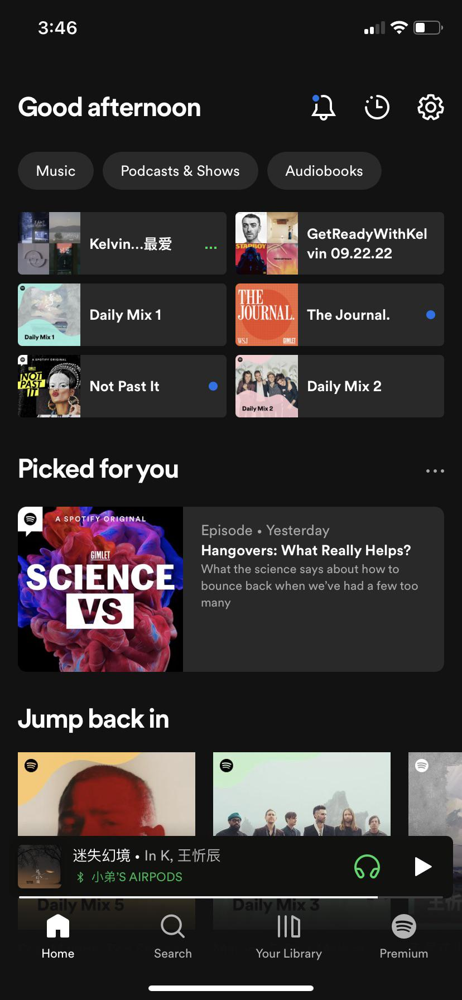

# 010_recycler_view

## RECYCLER VIEW TRONG ANDROID

- Recycler View là gì
- Ưu điểm của việc sử dụng RecyclerView
- Tính tái sử dụng của RecyclerView
- Adapter và ListAdapter
- RecyclerView Multiple View Type

- Bài tập : Dựng lại giao diện như hình dưới ( có thể tùy biến về giao diện miễn là đảm bảo yêu cầu sử dụng RecyclerView Multiple View Type )
- Gợi ý : Có thể sử dụng Glide để load ảnh

  
