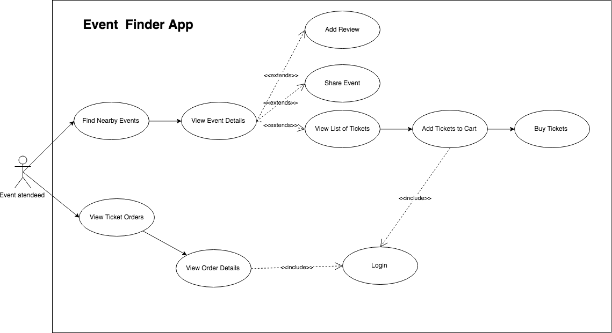
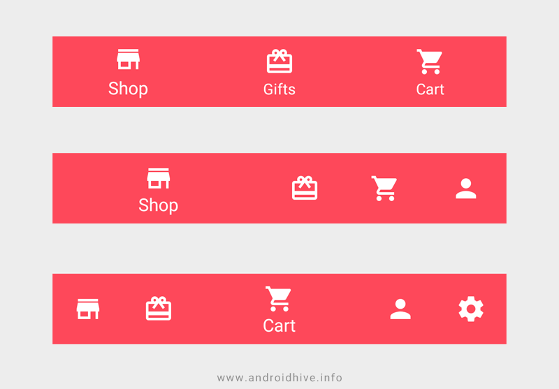
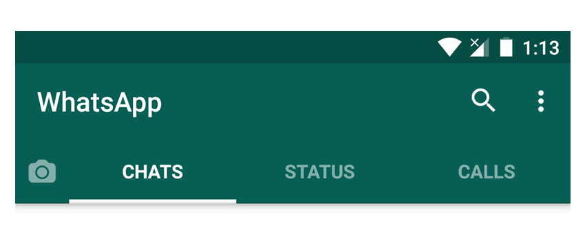
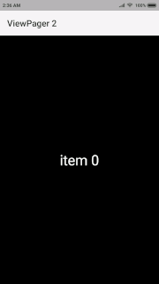

:memo: <span style="color:orange">MOBILE_011_ANDROID_NAVIGATION</span>

# NAVIGATION TRONG ANDROIDX



## Table of Content

- [NAVIGATION TRONG ANDROIDX](#navigation-trong-androidx)
  - [Table of Content](#table-of-content)
  - [I. Navigation](#i-navigation)
    - [1. Overview](#1-overview)
      - [Navigation Graph](#navigation-graph)
      - [Navigation Controller](#navigation-controller)
      - [Navigation Host](#navigation-host)
  - [II. Các navigation component](#ii-các-navigation-component)
    - [1. Bottom Navigation](#1-bottom-navigation)
    - [2. Tab Layout](#2-tab-layout)
  - [III. ViewPager2](#iii-viewpager2)

## I. Navigation

### 1. Overview

> Navigation là hành động cho phép người dùng điều hướng qua, vào, và quay lại từ những phần nội dung, màn hình khác nhau bên trong app.

- Navigation Components là một phần của Android Jetpack, một bộ công cụ hỗ trợ cho việc phát triển ứng dụng Android.
- Ưu điểm:
  - Xử lý thay cho các Fragment transactions.
  - Xử lý chính xác các hành động trên nút back của màn hình hay nút back của hệ thống.
  - Cung cấp các tài nguyên được tiêu chuẩn hóa cho animations và chuyển tiếp.
  - Thực hiện và xử lý liên kết sâu.
  - Nó hỗ trợ các navigation UI patterns, navigation drawers, và bottom navigation.
  - Được hỗ trợ Safe Args giúp truyền dữ liệu qua các thành phần bên trong Navigation  được an toàn hơn.
  - Hỗ trợ ViewModel hoàn chỉnh - Chúng ta có thể điều chỉnh và mở rộng ViewModel thành biểu đồ điều hướng để chia sẻ dữ liệu liên quan đến giao diện người dùng giữa các điểm đến của biểu đồ.
- 3 thành phần chính: Navigation Graph, Navigation Controller, Navigation Host.

#### Navigation Graph

> Là 1 file XML chứa tất cả các nội dung khu vực độc lập, nằm trong app gọi là destinations (điểm đến). Nó là một đồ thị mô tả một nhóm các Navigation destination và sự kết nối của chúng.


- 2 thành phần:
  - Navigation Destination: Có thể là một màn hình hoặc là một vài view trong ứng dụng. Trong Usecase Diagram trên thì ứng với mỗi use case tương ứng sẽ là một Navigation Destination (node).
  - Navigation Action: Là một đường dẫn kết nối một destination với một destination khác. Một action sẽ cho biết destination nào nó đang kết nối và loại thông tin sẽ xảy ra giữa chúng.

#### Navigation Controller

> Là 1 đối tượng để điều khiển sự điều hướng của đích đến cùng với NavHost. Nó điều khiển sự swap của các nội dung đích đến (destination content) khi người dùng điều hướng tới xuyên suốt app.

- Controller:
  
  ```kotlin
  Fragment.findNavController()
  View.findNavController()
  Activity.findNavController(viewId: Int)
  ```

#### Navigation Host

> Là 1 file XML dạng container rỗng sẽ hiển thị destination khi người dùng thực thi thao tác điều hướng.

- Có 2 loại Navigation Host chính:
  - NavHostFragment: Là một Fragment đặc biệt được sử dụng làm Navigation Host, có thể thêm NavHostFragment vào layout của màn hình và liên kết nó với một Navigation Graph. NavHostFragment sẽ hiển thị các Fragments theo hành động điều hướng từ Navigation Graph.
  - NavHostActivity: là một Activity đặc biệt được sử dụng làm Navigation Host, có thể tạo một NavHostActivity và liên kết nó với một Navigation Graph. NavHostActivity sẽ hiển thị các Activities theo hành động điều hướng từ Navigation Graph.

## II. Các navigation component

### 1. Bottom Navigation

- Android Bottom Navigation ở cuối màn hình cung cấp điều hướng giữa các chế độ views ở top-level trong ứng dụng.
- Điều này được giới thiệu trong design support library với khả năng tương thích ngược. Bottom Navigation được sử dụng khi ứng dụng có từ ba đến năm top-level điều hướng.

  

### 2. Tab Layout

- Là một thành phần giao diện người dùng cho phép bạn tổ chức nội dung của ứng dụng thành các tab. Mỗi tab sẽ hiển thị một màn hình hoặc một phần nội dung khác nhau.
- Tab Layout thường được sử dụng cùng với ViewPager hoặc ViewPager2 để người dùng có thể vuốt qua lại giữa các tab.

  

- Có 2 loại Tab Layout:
  - Tab cố định
  - Tab cuộn.
- Tab có một vùng chứa và mỗi mục tab có một biểu tượng và nhãn văn bản (hoặc 1 trong 2).

## III. ViewPager2

- ViewPager2 là một phiên bản cải tiến của ViewPager, được phát triển bởi Android để cung cấp một cách linh hoạt và hiệu quả hơn trong việc hiển thị các trang (pages) có thể cuộn ngang hoặc dọc trong một ứng dụng Android.
- Các Tính Năng Chính của ViewPager2
  - Hỗ trợ Cuộn Dọc và Ngang: ViewPager2 hỗ trợ cả cuộn ngang (mặc định) và cuộn dọc, cho phép tạo giao diện linh hoạt hơn, đặc biệt là khi muốn hiển thị nội dung cuộn dọc theo một trình tự liên tục.
  - Sử dụng RecyclerView Làm Nền Tảng: ViewPager2 được xây dựng trên RecyclerView, mang lại hiệu suất cao hơn và tính linh hoạt tốt hơn trong việc quản lý các view. Điều này có nghĩa là có thể dễ dàng áp dụng các tính năng của RecyclerView, như hỗ trợ cho các loại layout manager khác nhau (ví dụ: LinearLayoutManager cho cuộn dọc).
  - Hỗ Trợ Fragment: ViewPager2 làm việc rất tốt với các Fragment, giúp dễ dàng quản lý và hiển thị các trang dưới dạng các fragment độc lập. Điều này rất hữu ích khi muốn mỗi trang có logic riêng biệt.
  - Swipe To Dismiss: Một tính năng mới trong ViewPager2 là hỗ trợ "swipe to dismiss" (vuốt để hủy), thường được sử dụng trong các ứng dụng như trình duyệt ảnh.
  - RTL (Right-to-Left) Support: ViewPager2 có hỗ trợ tích hợp cho giao diện người dùng từ phải sang trái, giúp dễ dàng tạo ứng dụng hỗ trợ nhiều ngôn ngữ khác nhau.

  
