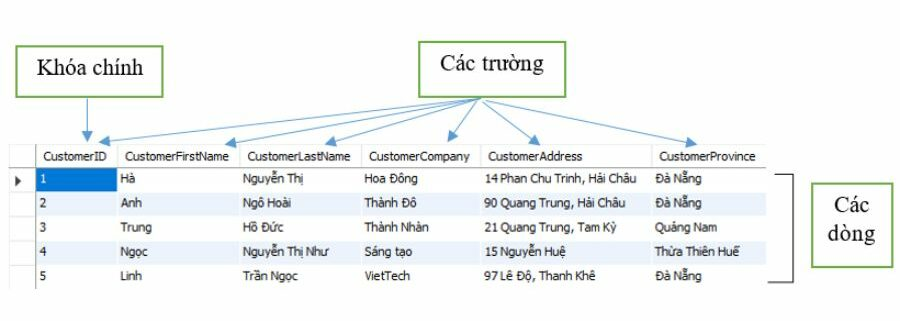
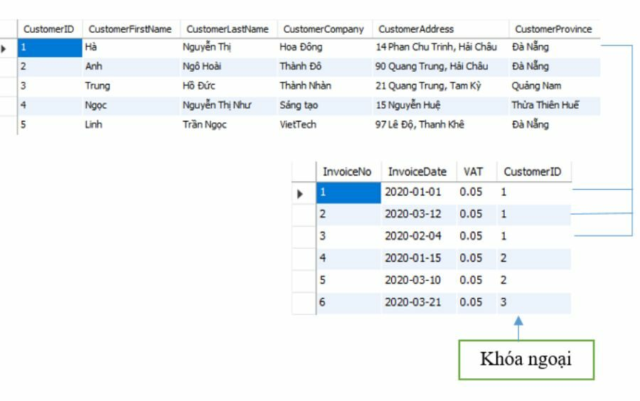
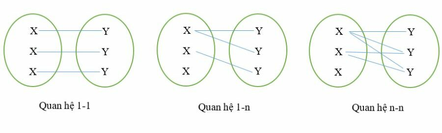
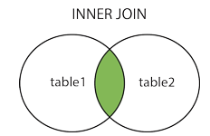
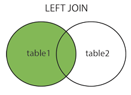
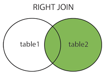
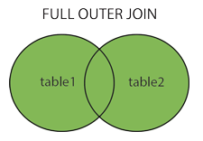

:memo: <span style="color:orange">MOBILE_012_DATABASE</span>

# CSDL


## Table of Content

- [CSDL](#csdl)
  - [Table of Content](#table-of-content)
  - [I. CSDL](#i-csdl)
    - [1. CSDL](#1-csdl)
    - [2. CSDL quan hệ](#2-csdl-quan-hệ)
  - [II. SQL](#ii-sql)
    - [1. SQL](#1-sql)
    - [2. Hệ quản trị CSDL](#2-hệ-quản-trị-csdl)
      - [MySQL](#mysql)
  - [III. Database, Table](#iii-database-table)
    - [1. Database](#1-database)
    - [2. Table](#2-table)
  - [IV. Thao tác với dữ liệu](#iv-thao-tác-với-dữ-liệu)
    - [1. Các câu lệnh INSERT, UPDATE, DELETE](#1-các-câu-lệnh-insert-update-delete)
      - [INSERT](#insert)
      - [UPDATE](#update)
      - [DELETE](#delete)
  - [V. Truy vấn đọc dữ liệu](#v-truy-vấn-đọc-dữ-liệu)
    - [1. SELECT](#1-select)
    - [Các điều kiện: WHERE, LIMIT, ORDER BY](#các-điều-kiện-where-limit-order-by)
      - [WHERE](#where)
      - [LIMIT](#limit)
      - [ORDER BY](#order-by)
      - [GROUP BY](#group-by)
      - [HAVING](#having)
    - [Các loại JOIN](#các-loại-join)
      - [INNER JOIN](#inner-join)
      - [LEFT OUTER JOIN (Hoặc LEFT JOIN)](#left-outer-join-hoặc-left-join)
      - [RIGHT OUTER JOIN (Hoặc RIGHT JOIN)](#right-outer-join-hoặc-right-join)
      - [FULL OUTER JOIN (Hoặc OUTER JOIN)](#full-outer-join-hoặc-outer-join)

## I. CSDL

### 1. CSDL

- CSDL được coi là một tập dữ liệu gắn kết logic với nhau. Các dữ liệu ngẫu nhiên không được coi là một CSDL (mặc dù chúng là những ngoại lệ). Nó có thể chứa bất kỳ loại dữ liệu nào, bao gồm từ, số, hình ảnh, video và tệp.
- VD: Thư viện là một cơ sở dữ liệu, phân loại sách theo chủ đề: xã hội, tự nhiên, khoa học … cũng là một dạng cở sở dữ liệu đơn giản.
- Mục đích :  Dễ quản lý và tìm kiếm, thống nhất việc lưu trữ thông tin, có thể tìm kiếm một cách nhanh chóng khi cần thông tin nào đó và cũng có thể lôi các “dòng họ” liên quan với thông tin đó ra luôn.

### 2. CSDL quan hệ

- Cơ sở dữ liệu quan hệ là một loại cơ sở dữ liệu lưu trữ cung cấp quyền truy cập vào các điểm dữ liệu có liên quan đến nhau. Cơ sở dữ liệu quan hệ dựa trên mô hình dữ liệu quan hệ, một cách trực quan, đơn giản để biểu diễn dữ liệu trong bảng.
- Trong cơ sở dữ liệu quan hệ, mỗi hàng trong bảng là một bản ghi với một ID duy nhất được gọi là khóa.
- Các cột của bảng chứa các thuộc tính của dữ liệu và mỗi bản ghi thường có một giá trị cho mỗi thuộc tính, giúp dễ dàng thiết lập mối quan hệ giữa các điểm dữ liệu.
- Thành phần:
  - Table: Bảng dữ liệu

    

  - Với:
    - Field (Cột/Trường): là trường dữ liệu thể hiện các thuộc tính của bảng. Chẳng hạn như: tên, địa chỉ…vv.
    - Row (dòng): là dòng dữ liệu gồm các thông tin dữ liệu liên quan với nhau gọi là bảng record ( bảng ghi).
    - Cell (ô): là các ô giao giữa các dòng và cột là nơi để chứa các dữ liệu.
    - Primary Key (Khóa chính): là một hoặc nhiều trường được gộp lại để định nghĩa bảng ghi. Không được trùng và cũng không được để trống. VD: ID.
  - Relationship: Mối quan hệ

    

  - Thì:
    - Foreign Key (Khóa ngoại): sẽ là trường ở bảng invoice này nhưng lại là khóa chính ở bảng customer kia, tạo nên một mối quan hệ giữa hai bảng với nhau.
    - Relationship (Mối quan hệ): sự kết nối giữa hai bảng để xác định mối liên quan giữa các trường dữ liệu. Cụ thể ví dụ như sau: để biết khách hàng mã số 1 đã mua những đơn hàng nào thì bạn cần xác định vào các mối quan hệ trên. Biểu hiện ở 3 dạng sau:
      - Mối quan hệ 1-1: Mỗi bảng ghi chỉ có một và một bảng tướng ứng mà thôi
      - Mối quan hệ 1-n: Mối quan hệ này khá phổ biến trong cơ sở dữ liệu. Trong mối quan hệ này thì 1 bảng ghi ở bảng này có thể có nhiều bảng ghi tương ứng ở bảng kia.
      - Mối quan hệ n-n: Trong mối quan hệ này thì 1 bảng ghi ở bảng này có thể có nhiều bảng ghi tương ứng ở bảng kia và ngược lại.

      

## II. SQL

### 1. SQL

- Ngôn ngữ truy vấn có cấu trúc (SQL) là một ngôn ngữ lập trình phục vụ việc lưu trữ và xử lý thông tin trong cơ sở dữ liệu quan hệ.
- Cơ sở dữ liệu quan hệ lưu trữ thông tin dưới dạng bảng có các hàng và cột đại diện cho những thuộc tính dữ liệu và nhiều mối quan hệ khác nhau giữa các giá trị dữ liệu.
- Có thể sử dụng các câu lệnh SQL để lưu trữ, cập nhật, loại bỏ, tìm kiếm và truy xuất thông tin từ cơ sở dữ liệu. Cũng có thể sử dụng SQL để duy trì và tối ưu hóa hiệu suất cơ sở dữ liệu.

### 2. Hệ quản trị CSDL

- Hệ quản trị CSDL (DBMS – Database management system) là một hệ thống phần mềm cho phép tạo lập CSDL và điều khiển mọi truy nhập đến CSDL đó.
- Các đặc điểm (chức năng) quan trọng của một hệ quản trị CSDL:
    1. Cho phép người dùng tạo mới CSDL, thông qua ngôn ngữ định nghĩa dữ liệu (DDLs – Data Definition Languages).
    2. Cho phép người dùng truy vấn cơ sở dữ liệu, thông qua ngôn ngữ thao tác dữ liệu (DMLs – Data Manipulation Languages).
    3. Hỗ trợ lưu trữ số lượng lớn dữ liệu, thường lên tới hàng Gigabytes hoặc nhiều hơn, trong một thời gian dài. Duy trì tính bảo mật và tính toàn vẹn trong quá trình xử lý.
    4. Kiểm soát truy nhập dữ liệu từ nhiều người dùng tại cùng một thời điểm
- Ví dụ: MySQL, SQL Server, Oracle Database….
- Mỗi Hệ quản trị CSDL khác nhau sẽ viết bằng ngôn ngữ quản trị CSDL khác nhau. Tuy nhiên có 1 số câu lệnh trong SQL Server vs MySQL vs Ocracle lại có cấu trúc lệnh và chức năng giống nhau!

#### MySQL

- MySQL là một hệ thống quản trị cơ sở dữ liệu mã nguồn mở (Relational Database Management System, viết tắt là RDBMS) hoạt động theo mô hình client-server.

:bulb: Mô hình client-server: Một máy client sẽ liên lạc với máy server trong một mạng nhất định. Mỗi client có thể gửi một request từ giao diện người dùng (Graphical user interface – GUI) trên màn hình, và server sẽ trả về kết quả như mong muốn.

- MySQL tạo ra bảng để lưu trữ dữ liệu, định nghĩa sự liên quan giữa các bảng đó.
- Client sẽ gửi yêu cầu SQL bằng một lệnh đặc biệt trên MySQL.
- Ứng dụng trên server sẽ phản hồi thông tin và trả về kết quả trên máy client.

## III. Database, Table

### 1. Database

- Database là cơ sở dữ liệu, là một bộ sưu tập dữ liệu được tổ chức bài bản và thường được truy cập từ hệ thống máy tính hoặc tồn tại dưới dạng tập tin trong hệ quản trị cơ sở dữ liệu.

- Cách tạo database:
  - Nhấp vào New Query hoặc phím tắt Ctrl + N
  - Nhập câu lệnh:

  ```sql
  CREATE DATABASE <tên database>;

  CREATE DATABASE sinhvien;
  ```

- Xóa database:

  ```sql
  DROP DATABASE <tên database cần xóa>;
  ```

### 2. Table

- Trong cơ sở dữ liệu (database), một table (bảng) là một cấu trúc dữ liệu dùng để tổ chức và lưu trữ dữ liệu dưới dạng hàng và cột. Mỗi bảng trong cơ sở dữ liệu bao gồm nhiều cột, mỗi cột tương ứng với một thuộc tính cụ thể, và nhiều hàng, mỗi hàng chứa một tập hợp các giá trị thuộc về các cột tương ứng.
- Các thành phần cơ bản của một bảng trong cơ sở dữ liệu:
  - Tên bảng: Tên duy nhất được sử dụng để xác định bảng trong cơ sở dữ liệu.
  - Cột (Column): Mỗi cột trong bảng biểu thị một thuộc tính của dữ liệu. Mỗi cột có một tên và kiểu dữ liệu nhất định (như INT, VARCHAR, DATE, v.v.).
  - Hàng (Row): Mỗi hàng trong bảng biểu thị một bản ghi (record) của dữ liệu. Mỗi hàng chứa các giá trị cụ thể cho các cột trong bảng.
  - Khóa chính (Primary Key): Một cột hoặc một nhóm cột mà các giá trị trong đó là duy nhất cho mỗi hàng, dùng để xác định một cách duy nhất mỗi bản ghi trong bảng.
  - Khóa ngoại (Foreign Key):  Là một hoặc nhiều cột trong bảng này tham chiếu đến khóa chính của bảng khác, tạo liên kết giữa các bảng.
  - Chỉ mục (Index): Một cấu trúc dữ liệu đặc biệt giúp tăng tốc quá trình truy vấn dữ liệu trong bảng.
- Ví dụ:

  ```sql
  CREATE TABLE Employees (
    EmployeeID INT PRIMARY KEY,
    FirstName VARCHAR(50),
    LastName VARCHAR(50),
    DateOfBirth DATE,
    DepartmentID INT,
    FOREIGN KEY (DepartmentID) REFERENCES Departments(DepartmentID)
  );
  ```

## IV. Thao tác với dữ liệu

### 1. Các câu lệnh INSERT, UPDATE, DELETE

#### INSERT

- Lệnh INSERT INTO trong SQL được sử dụng để thêm các hàng dữ liệu mới vào một bảng trong Database.
- Cú pháp:

  ```sql
  INSERT INTO TABLE_TEN (cot1, cot2, cot3,...cotN)

  VALUES (giatri1, giatri2, giatri3,...giatriN);
  ```

- Ví dụ:

  ```sql
  CREATE TABLE Employee (
    EmployeeID INT AUTO_INCREMENT PRIMARY KEY,
    FirstName VARCHAR(50) NOT NULL,
    LastName VARCHAR(50) NOT NULL,
    DateOfBirth DATE,
    Salary DECIMAL(10, 2)
  );

  INSERT INTO Employee (EmployeeID, FirstName, LastName, DateOfBirth, Salary)
  VALUES (1, 'John', 'Doe', '1985-06-15', 2);

  SELECT * FROM Employee
  ```

- Khi các bạn muốn chèn liên tục nhiều hàng vào bên trong bảng, có thể sử dụng một câu lệnh INSERT INTO duy nhất (khai báo nhiều bộ giá trị, đồng thời thêm một dấu phẩy nằm ngăn cách giữa chúng).

#### UPDATE

- Truy vấn UPDATE trong SQL được sử dụng để sửa đổi các bản ghi đang tồn tại trong một bảng.
- Có thể sử dụng mệnh đề WHERE với truy vấn UPDATE sửa đổi các hàng đã lựa chọn, nếu không, hệ thống sẽ mặc định là tất cả các hàng đều bị tác động.
- Cú pháp:

  ```sql
  UPDATE ten_bang
  SET cot1 = giatri1, cot2 = giatri2...., cotN = giatriN
  WHERE [dieu_kien];
  ```

#### DELETE

- Xóa các hàng trong bảng
- Cú pháp:

  ```sql
  DELETE FROM ten_bang
  WHERE [dieu_kien];
  ```

## V. Truy vấn đọc dữ liệu

### 1. SELECT

- Lệnh SELECT trong SQL được sử dụng để lấy dữ liệu từ một bảng trong Database mà trả về dữ liệu ở dạng bảng dữ liệu kết quả.
- Cú pháp:

  ```sql
  SELECT cot1, cot2, cotN FROM ten_bang;

  SELECT * FROM ten_bang;
  ```

### Các điều kiện: WHERE, LIMIT, ORDER BY

#### WHERE

- Mệnh đề WHERE trong SQL được sử dụng để xác định một điều kiện trong khi lấy dữ liệu từ bảng đơn hoặc nhiều bảng kết hợp.
- Sử dụng mệnh đề WHERE để lọc các bản ghi và chỉ lấy lại các bản ghi cần thiết.
- Cú pháp:

  ```sql
  SELECT cot1, cot2, cotN
  FROM ten_bang
  WHERE [dieu_kien]
  ```

- `condition` là biểu thức điều kiện để chọn lọc dữ liệu, thường có ba thành phần cơ bản: `tên cột`, `toán tử so sánh`, `giá trị`

| =          | Bằng.                                     |
| ---------- | ----------------------------------------- |
| >          | Lớn hơn.                                  |
| <          | Nhỏ hơn.                                  |
| >=         | Lớn hơn hoặc bằng.                        |
| <=         | Nhỏ hơn hoặc bằng.                        |
| <> hoặc != | Khác                                      |
| BETWEEN    | Nằm trong một phạm vi giá trị.            |
| LIKE       | Tìm kiếm dựa theo mẫu chuỗi.              |
| IN         | Nằm trong số những giá trị được chỉ định. |

#### LIMIT

- Hạn chế số lượng bản ghi được trả về bởi câu lệnh SELECT
- Cú pháp:

  ```sql
  SELECT cot1, cot2, cotN
  FROM ten_bang
  LIMIT [number];

  -- Trong SQL Server không có lệnh LIMIT, thay bằng TOP [number] đặt sau SELECT.
  ```

#### ORDER BY

- Dùng để sắp xếp dữ liệu theo thứ tự tăng dần hoặc giảm dần, dựa trên một hoặc nhiều cột.
- Cú pháp:

  ```sql
  SELECT cot1, cot2, cotN
  FROM ten_bang
  ORDER BY cot1, cot2, cotN [ASC | DESC];

  -- Sắp xếp tăng dần hoặc giảm dần. 
  ```

#### GROUP BY

- Mệnh đề GROUP BY trong SQL được sử dụng kết hợp với lệnh SELECT để sắp xếp dữ liệu đồng nhất vào trong các nhóm.
- Thường được sử dụng với các hàm COUNT(), MAX(), MIN(), SUM(), AVG()
- Cú pháp:

  ```sql
  SELECT cot1, cot2
  FROM ten_bang
  WHERE [ dieu_kien ]
  GROUP BY cot1, cot2
  ```

#### HAVING

- Thường được dùng với mệnh đề `GROUP BY` lọc nhóm dựa trên một điều kiện xác định sau khi nhóm
- Nếu bỏ qua mệnh đề `GROUP BY`, mệnh đề `HAVING` sẽ hoạt động giống như mệnh đề `WHERE`.
- Cú pháp:

  ```sql
  SELECT cot1, cot2
  FROM ten_bang
  WHERE [dieu_kien]
  GROUP BY cot1, cot2
  HAVING [dieu_kien]
  ORDER BY cot1, cot2;
  ```

### Các loại JOIN

- Là phép kết nối dữ liệu từ nhiều bảng lại với nhau, nối 2 bảng, 3 bảng.. với nhau. Khi cần truy vấn các cột dữ liệu từ nhiều bảng khác nhau để trả về trong cùng một tập kết quả, dùng JOIN. 2 bảng kết nối được với nhau khi có 1 trường chung giữa 2 bảng này.

#### INNER JOIN



- Trả về tất cả các hàng khi có ít nhất một giá trị ở cả hai bảng
  
#### LEFT OUTER JOIN (Hoặc LEFT JOIN)



- Trả lại tất cả các dòng từ bảng bên trái, và các dòng đúng với điều kiện từ bảng bên phải

#### RIGHT OUTER JOIN (Hoặc RIGHT JOIN)



- Trả lại tất cả các hàng từ bảng bên phải, và các dòng thỏa mãn điều kiện từ bảng bên trái

#### FULL OUTER JOIN (Hoặc OUTER JOIN)



- Trả về tất cả các dòng đúng với 1 trong các bảng.