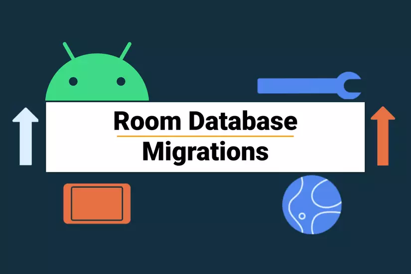

:memo: <span style="color:orange">MOBILE_013_ROOM_DATABASE</span>

# ROOM DATABASE TRONG ANDROID

- So sánh SQLite và MySQL.
- Room database là gì? Cách tạo Room Database trong Android
- DAO và Entity là gì? Cách sử dụng chúng?
- Relationship trong Room và cách sử dụng?



## Table of Content

- [ROOM DATABASE TRONG ANDROID](#room-database-trong-android)
  - [Table of Content](#table-of-content)
  - [I. SQLite và MySQL](#i-sqlite-và-mysql)
    - [1. **Kiến trúc**](#1-kiến-trúc)
    - [2. **Cài đặt và triển khai**](#2-cài-đặt-và-triển-khai)
    - [3. **Hiệu suất**](#3-hiệu-suất)
    - [4. **Tính năng**](#4-tính-năng)
    - [5. **Tính di động**](#5-tính-di-động)
    - [6. **Khả năng mở rộng**](#6-khả-năng-mở-rộng)
    - [7. **Trường hợp sử dụng**](#7-trường-hợp-sử-dụng)
    - [Tóm lại](#tóm-lại)
  - [II. Room database](#ii-room-database)
    - [1. Room database](#1-room-database)
    - [2. Entity](#2-entity)
    - [3. DAO (Data Access Object)](#3-dao-data-access-object)
    - [3. Cách tạo Room database](#3-cách-tạo-room-database)
  - [Relationship trong Room](#relationship-trong-room)

## I. SQLite và MySQL

SQLite và MySQL đều là các hệ quản trị cơ sở dữ liệu quan hệ (RDBMS) phổ biến, nhưng chúng có những khác biệt đáng kể về cách hoạt động, tính năng và trường hợp sử dụng:

### 1. **Kiến trúc**

- **SQLite**:
  - Là một thư viện phần mềm nhúng và không có mô hình máy chủ-máy khách.
  - Dữ liệu được lưu trữ trong một tệp tin đơn giản trên hệ thống tệp của ứng dụng.
- **MySQL**:
  - Là một hệ thống máy chủ-máy khách, có thể hoạt động trên nhiều máy tính khác nhau thông qua mạng.
  - Dữ liệu được lưu trữ trên máy chủ và có thể truy cập từ các ứng dụng từ xa.

### 2. **Cài đặt và triển khai**

- **SQLite**:
  - Cực kỳ nhẹ, không cần cài đặt riêng biệt, chỉ cần tích hợp thư viện SQLite vào ứng dụng.
  - Thích hợp cho các ứng dụng đơn lẻ hoặc hệ thống nhúng.
- **MySQL**:
  - Yêu cầu cài đặt và cấu hình máy chủ.
  - Thường được sử dụng cho các ứng dụng web, hệ thống doanh nghiệp, hoặc các dự án lớn cần quản lý nhiều kết nối từ nhiều máy khách.

### 3. **Hiệu suất**
  
- **SQLite**:
  - Hiệu suất cao cho các ứng dụng đơn lẻ hoặc các thao tác đọc-ghi cường độ thấp.
  - Không phù hợp cho các hệ thống cần xử lý đồng thời nhiều giao dịch hoặc có khối lượng dữ liệu lớn.
- **MySQL**:
  - Được tối ưu hóa cho các tác vụ xử lý nặng, nhiều kết nối đồng thời, và khối lượng dữ liệu lớn.
  - Có thể xử lý hàng triệu giao dịch mỗi ngày trong môi trường sản xuất.

### 4. **Tính năng**

- **SQLite**:
  - Hỗ trợ một số tính năng cơ bản của SQL như truy vấn, chỉ mục, khóa ngoại, v.v.
  - Không hỗ trợ một số tính năng nâng cao như người dùng đa dạng, vai trò, hoặc các chức năng lưu trữ phức tạp.
- **MySQL**:
  - Hỗ trợ đầy đủ các tính năng SQL nâng cao như stored procedures, triggers, views, và phân quyền người dùng.
  - Hỗ trợ replication, clustering, và các cơ chế bảo mật nâng cao.

### 5. **Tính di động**

- **SQLite**:
  - Cực kỳ di động, chỉ cần copy tệp dữ liệu để di chuyển cơ sở dữ liệu.
- **MySQL**:
  - Tính di động kém hơn, dữ liệu thường được lưu trữ trên máy chủ và cần các công cụ hỗ trợ để sao lưu và phục hồi.

### 6. **Khả năng mở rộng**

- **SQLite**:
  - Không phù hợp để mở rộng quy mô với số lượng lớn người dùng hoặc giao dịch.
- **MySQL**:
  - Dễ dàng mở rộng quy mô thông qua việc thêm máy chủ hoặc sử dụng các công nghệ phân tán.

### 7. **Trường hợp sử dụng**

- **SQLite**:
  - Thích hợp cho các ứng dụng đơn giản, ứng dụng di động, phát triển thử nghiệm, hoặc các hệ thống nhúng.
- **MySQL**:
  - Phù hợp cho các ứng dụng web, hệ thống doanh nghiệp, hoặc bất kỳ ứng dụng nào yêu cầu xử lý dữ liệu mạnh mẽ và khả năng mở rộng.

### Tóm lại

- **SQLite** là lựa chọn tốt cho các ứng dụng nhẹ, đơn giản và không cần nhiều người dùng truy cập cùng lúc.
- **MySQL** thích hợp cho các dự án phức tạp, yêu cầu xử lý nhiều giao dịch đồng thời và có khả năng mở rộng trong tương lai.

## II. Room database

### 1. Room database

- Room Database(Room Persistence Library) là một phần trong Android Architecture Components.
- Thư viện lưu trữ Room cung cấp một lớp trừu tượng qua SQLite để mang lại khả năng truy cập cơ sở dữ liệu dễ dàng, đồng thời khai thác toàn bộ sức mạnh của SQLite. Cụ thể, Room đem lại các lợi ích sau:
  - Xác minh thời gian biên dịch của truy vấn SQL.
  - Chú thích tiện lợi giúp giảm thiểu mã nguyên mẫu lặp lại, dễ mắc lỗi.
  - Hợp lý hoá đường dẫn di chuyển cơ sở dữ liệu.
- Thành phần chính:

  

  - Lớp database lưu giữ cơ sở dữ liệu và đóng vai trò là điểm truy cập chính cho đường kết nối cơ bản đến dữ liệu cố định của ứng dụng.
  - Data entities biểu thị các bảng trong cơ sở dữ liệu của ứng dụng.
  - Data access objects (DAOs) cung cấp các phương thức mà ứng dụng của bạn có thể dùng để truy vấn, cập nhật, chèn và xoá dữ liệu trong cơ sở dữ liệu.
- Ứng dụng sẽ thông qua Room Database để khai báo ra một instance của cơ sở dữ liệu, đồng thời khai báo các Entity sẽ dùng, mỗi Entity sẽ có một DAO để quản lý. Ứng dụng sẽ sử dụng các DAO này để mà đọc, ghi, xóa, sửa gì đó trên các Entity. Vậy là xong, phần bên dưới cơ sở dữ liệu thì Room sẽ lo liệu.

### 2. Entity

- Nếu như với SQLite là một dạng cơ sở dữ liệu được xây dựng dựa trên các Table. Vậy thì với Room, hầu như không cần làm việc với khái niệm Table nữa. Mà dùng chính Entity này để thay thế.
- Về mặt sử dụng thì Entity là một lớp, nhưng khi biên dịch Room sẽ dựa vào mỗi lớp Entity đã định nghĩa để tạo ra các Table tương ứng. Các thuộc tính bên trong lớp Entity chính là các cột của Table đó.

  ```kotlin
  @Entity
  data class User(
    @PrimaryKey val uid: Int,
    @ColumnInfo(name = "first_name") val firstName: String?,
    @ColumnInfo(name = "last_name") val lastName: String?
  )
  ```

- Ví dụ:

  ```kotlin
  @Entity(tableName = "note_table")
  data class Note(
    @PrimaryKey(autoGenerate = true) val id: Int = 0,
    @ColumnInfo(name = "title") val title: String,
    @ColumnInfo(name = "content") val content: String
  )
  ```

  - Mã đây định nghĩa một thực thể dữ liệu User. Mỗi thực thể của User biểu thị một hàng trong bảng user thuộc cơ sở dữ liệu của ứng dụng.
- Các annotation:
  - **`*@Entity*`**: Phải khai báo annotation này trước mỗi **Entity** để **Room** hiểu rằng đây là một **Entity**, và vì vậy nó sẽ giúp tạo ra một **Table** bên trong cơ sở dữ liệu. Trong khi sử dụng annotation **@Entity** này, chúng ta cũng sẽ sử dụng đến thuộc tính **tableName** để chỉ định tên của **Table**
  - **`*@PrimaryKey*`**: Giúp định nghĩa khóa chính của **Table**. Có thuộc tính **autoGenerate** để cho phép hệ thống tự tạo ra giá trị **id**
  - **`*@ColumnInfo`**: Kết hợp với thuộc tính kèm theo là **name** để đặt lại tên cho **Column** (cột) của **Table**. Nếu không khai báo ColumnInfo, khi đó Room sẽ lấy tên của thuộc tính làm tên của Column.

### 3. DAO (Data Access Object)

- Đây là một đối tượng chịu trách nhiệm làm việc chính với các Entity trong cơ sở dữ liệu. - Đối tượng này sẽ giúp định nghĩa các phương thức tương tác với các Entity, chẳng hạn như, insert(), getAll(), delete(),…
- Khác với kiểu SQLiteDatabase ngày xưa tốn khá nhiều code để viết nên các phương thức này. DAO sẽ cung cấp các annotation hoặc các kiểu viết câu truy vấn sao cho gọn gàng, nhanh chóng, và dễ quản lý nhất có thể.

  ```kotlin
  @Dao
  interface UserDao {
    @Query("SELECT * FROM user")
    fun getAll(): List<User>

    @Query("SELECT * FROM user WHERE uid IN (:userIds)")
    fun loadAllByIds(userIds: IntArray): List<User>

    @Query("SELECT * FROM user WHERE first_name LIKE :first AND " +
           "last_name LIKE :last LIMIT 1")
    fun findByName(first: String, last: String): User

    @Insert
    fun insertAll(vararg users: User)

    @Delete
    fun delete(user: User)
  }
  ```

- Ví dụ:

  ```kotlin
  @Dao
  interface ItemDao {
 
    @Query("SELECT * FROM note_table ORDER BY id ASC")
    suspend fun getAllNotes(): List<Note>
 
    @Query("SELECT * FROM note_table WHERE title LIKE :title")
    suspend fun findNoteByTitle(title: String): Note
 
    @Insert
    suspend fun insert(note: Note)
 
    @Delete
    suspend fun delete(note: Note)
    
    @Update  
    suspend fun update(Item... items)
  }
  ```

- Lớp lãnh nhiệm chức năng là một DAO này phải là một interface. Do đó các phương thức bên trong lớp này sẽ không cần phải khai báo thân hàm.
- Các annotation:
  - **`*@Dao*`**: giúp ***Room*** hiểu rằng đây là một ***DAO*** và sẽ hành xử với các phương thức đi kèm nó với các annotation.
  - **`*@Insert`, `@Update`, `@Delete`***: Là các annotation liên quan đến các chức năng thêm, sửa, xóa đối với các ***table*** của cơ sở dữ liệu.
    - phương thức ***insert()*** của mình nên đi kèm với annotation @***Insert***.
    - Phương thức ***delete()*** đi kèm với annotation ***@Delete***.
  - **`*@Query*`**: Giúp viết các câu truy vấn vào trong đó.

### 3. Cách tạo Room database

- Cài đặt thư viện:

  ```kotlin
  dependencies {
    val room_version = "2.6.1"

    implementation("androidx.room:room-runtime:$room_version")
    annotationProcessor("androidx.room:room-compiler:$room_version")

    // de su dung cong cu chu thich
    kapt("androidx.room:room-compiler:$room_version")
    // de su dung xu li bieu tuong
    ksp("androidx.room:room-compiler:$room_version")
  }
  ```

- Đoạn mã sau đây định nghĩa một lớp AppDatabase để lưu giữ cơ sở dữ liệu. AppDatabase định nghĩa cấu hình cơ sở dữ liệu và đóng vai trò là điểm truy cập chính của ứng dụng vào dữ liệu cố định. Lớp cơ sở dữ liệu phải đáp ứng các điều kiện sau:
  - Lớp phải được chú thích bằng thẻ chú thích @Database có chứa mảng (array) entities liệt kê mọi thực thể dữ liệu được liên kết với cơ sở dữ liệu.
  - Lớp này phải là một lớp trừu tượng mở rộng RoomDatabase.
Đối với mỗi lớp DAO được liên kết với cơ sở dữ liệu, lớp cơ sở dữ liệu phải định nghĩa một phương thức trừu tượng không có đối số và trả về một thực thể của lớp DAO.

  ```kotlin
  @Database(entities = [User::class], version = 1)
  abstract class AppDatabase : RoomDatabase() {
    abstract fun userDao(): UserDao
  }
  ```
  
- Ví dụ:

  ```kotlin
  @Database(entities = [Note::class], version = 1)
  abstract class NoteRoomDatabase : RoomDatabase() {
 
    abstract fun noteDao(): NoteDao
 
    companion object {
        private var INSTANCE: NoteRoomDatabase?= null
        private val DB_NAME = "note_db"
 
        fun getDatabase(context: Context): NoteRoomDatabase {
            val tempInstance = INSTANCE
            if (tempInstance != null) {
                return tempInstance
            }
            synchronized(this) {
                val instance = Room.databaseBuilder(
                    context.applicationContext,
                    NoteRoomDatabase::class.java,
                    DB_NAME
                ).build()
                INSTANCE = instance
                return instance
            }
        }
    }
  }
  ```

- RoomDatabase phải là một lớp abstract. Sau đó nó phải kế thừa từ lớp RoomDatabase. Bên trong lớp này phải xây dựng các phương thức abstract để lấy về các Dao đã khai báo.
- Trong suốt quá trình sống của ứng dụng, chúng ta chỉ cần duy nhất một RoomDatabase thôi, do đó hãy xây dựng lớp này theo mô hình mẫu có tên Singleton.

## Relationship trong Room

- - Mặc dù Room không hỗ trợ trực tiếp ràng buộc giữa các mối quan hệ, nhưng  cho phép xác định các ràng buộc Foreign keys giữa các Entities. → Thông qua annotation **`*@ForeignKey*`**
- Hiện tại ROOM, đã hỗ trợ implement những relations: 1 - 1; 1 - n; n - n với annotation **`*@Relation*`**
