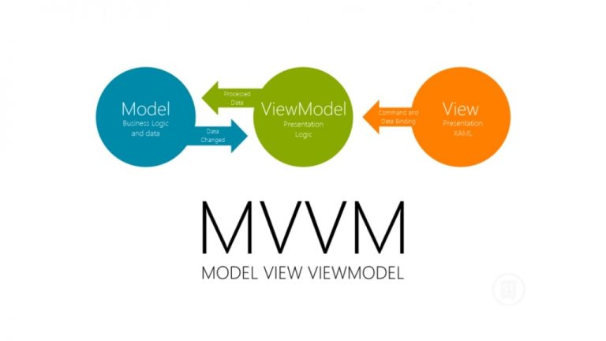

:memo: <span style="color:orange">MOBILE_014_VIEWMODEL_LIVEDATA_MVVM</span>

# MVVM TRONG ANDROID



## Table of Content

- [MVVM TRONG ANDROID](#mvvm-trong-android)
  - [Table of Content](#table-of-content)
  - [I. ViewModel](#i-viewmodel)
  - [II. LiveData](#ii-livedata)
  - [III. MVVM Architecture](#iii-mvvm-architecture)

## I. ViewModel

> ViewModel là một phần trong Android Architechture Component. Là một class có trách nhiệm chuẩn bị và quản lý dữ liệu cho một UI component (có thể là Activity hoặc Fragment) mà không bị ảnh hưởng bởi vòng đời của các thành phần giao diện người dùng như Activity hoặc Fragment.

:bulb: Android Architechture Component là một kiến trúc bao gồm nhiều thư viện khác nhau, mang đến các công cụ cần thiết để thiết kế ra các ứng dụng mạnh mẽ, ổn định và dễ bảo trì.

- Mục đích chính của ViewModel đó là lấy và giữ thông tin cần thiết cho activity và fragment.
- ViewModel chỉ có trách nhiệm quản lý data cho UI cho nên nó không bao giờ truy cập vào View Hierarchy hoặc giữ tham chiếu đến Activity hoặc Fragment.
- ViewModel với sự hỗ trợ của LiveData có thể phản ứng lại sự thay đổi của UI. Mỗi khi data thay đổi, UI sẽ được cập nhật dựa trên sự quan sát LiveData với data hiện tại trong ViewModel.

- ViewModel luôn được tạo trong cùng một phạm vi (một fragment hoặc một activity) và sẽ được giữ lại cho đến khi phạm vi đó còn "sống". Hay nói cách khác là ViewModel sẽ không bị Destroyed khi Activity hoặc Fragment của nó bị Destroyed bởi một Configuration Change (ví dụ như việc xoay màn hình). Instance mới của các owner này sẽ chỉ kết nối lại với ViewModel hiện có của nó.
- Để khắc phục configuration change có 2 cách:
  - Sử dụng callback `onSaveInstanceState()` để lưu trữ dữ liệu rồi sau đó khôi phục lại nó ở lần gọi `onCreate()` kế tiếp.
  - Khai báo thuộc tính `android:configChanges` trong thẻ Activity của Manifest để tránh việc hệ thống hủy và khởi tạo lại Activity đó, khi đó bạn có thể bảo toàn được dữ liệu, hoặc có thể thiết lập lại dữ liệu này trong phương thức `onConfigurationChanged()`.
  ⇒ Cả hai kỹ thuật này cũng chỉ hỗ trợ lưu trữ các dữ liệu nhỏ, nếu dữ liệu cần lưu trữ và khôi phục lại quá lớn, nó có thể làm chậm ứng dụng.
- Vòng đời:

  

  - Vòng đời của một ***ViewModel*** sẽ bắt đầu khi ***Activity (Fragment) created***, trải qua các trạng thái **`*onCreate*`**, **`*onStart*`**, **`*onResume`.***
  - Sau đó dù cho ***Activity rotated*** (xoay màn hình), với các trạng thái **`*onPause*`**, **`*onStop*`**, **`*onDestroy*`**, **`*onCreate*`**, **`*onStart*`**, **`*onResume*`** mà ***ViewModel*** vẫn còn sống.
  - Khi kết thúc sự kiện **`*onDestroy*`** thì ***ViewModel*** mới kết thúc sứ mệnh bảo vệ dữ liệu cho Activity.
- Sử dụng:
  - Thêm dependency: `implementation("androidx.lifecycle:lifecycle-viewmodel-ktx:2.2.0")`
  - Thêm class:

  ```kotlin
  class SampleViewModel :ViewModel() {
    private var number: Int = 0

    fun addNumber() {
        number++
    }

    fun getNumber() : Int = number
  }
  ```

- Tạo ViewModel instance trong Activity: Sử dụng ViewModelProvider, cần truyền Context và tên class ViewModel để lấy instance.

  ```kotlin
  class MainActivity : AppCompatActivity() {
    lateinit var binding: ActivityMainBinding
    lateinit var viewModel: MainActivityViewModel

    override fun onCreate(savedInstanceState: Bundle?) {
        super.onCreate(savedInstanceState)

        binding = ActivityMainBinding.inflate(layoutInflater)
        viewModel = ViewModelProvider(this).get(MainActivityViewModel::class.java)
        
        binding.textView.text = viewModel.getNumber().toString()
        setContentView(binding.root)

        binding.buttonClick.setOnClickListener {
            viewModel.addNumber()
            binding.textView.text = viewModel.getNumber().toString()
        }
    }
  }
  ```

## II. LiveData

> LiveData là một phần trong Android Architechture Component. Là một class giữ dữ liệu quan sát được, dựa trên mô hình Observer.

:bulb: Mô hình **Observer** được xây dựng với ý tưởng sẽ có một **đối tượng trung tâm** (còn được gọi là **Subject**), đối tượng trung tâm này nắm danh sách các **đối tượng quan sát** khác (đối tượng quan sát chính là các **Observer**). Để rồi khi có **bất kỳ thay đổi** nào với trạng thái của **Subject**, nó sẽ **thông báo** ngay cho các **Observer** được biết.

- Ở đây các Subject là các ViewModel, các Observer là các Component (Activity, Fragment, Service).

- Không giống như một thiết bị quan sát thông thường, LiveData nhận biết vòng đời, có nghĩa là nó tôn trọng vòng đời của các thành phần ứng dụng khác, chẳng hạn như các activities, fragments hoặc services. Nhận thức này đảm bảo LiveData chỉ cập nhật các thành phần ứng dụng quan sát nó khi những thành phần này đang ở trạng thái hoạt động.
- Các loại LiveData:
  - **LiveData:** Chỉ có thể quan sát dữ liệu mà không thay đổi nó được.
  - **MutableLiveData:**
    - Có thể thay đổi được và là ****1 **subclass** của **LiveData.**
    - Sử dụng các phương thức `postValue()` và `setValue()`.
  - **MediatorLivedata**: Quan sát các source và phản ứng với sự kiện `onChange()` . Cho chúng ta quyền kiểm soát khi nào chúng ta muốn thực hiện một hành động cụ thể
- Cách sử dụng:
  - Tạo 1 đối tượng của LiveData

  ```kotlin
  class MyViewModel : ViewModel() {
    private val _data = MutableLiveData<String>()

    val data: LiveData<String>
        get() = _data
  }
  ```

  - Quán sát đối tượng LiveData

  ```kotlin
  class NameActivity : AppCompatActivity() {

    // Use the 'by viewModels()' Kotlin property delegate
    // from the activity-ktx artifact
    private val model: NameViewModel by viewModels()

    override fun onCreate(savedInstanceState: Bundle?) {
        super.onCreate(savedInstanceState)

        // Other code to setup the activity...

        // Create the observer which updates the UI.
        val nameObserver = Observer<String> { newName ->
            // Update the UI, in this case, a TextView.
            nameTextView.text = newName
        }

        // Observe the LiveData, passing in this activity as the LifecycleOwner and the observer.
        model.currentName.observe(this, nameObserver)
    }
  }
  ```

  - Sau khi observe() được gọi và có nameObserver được chuyển dưới dạng thông số, onChanged() sẽ được gọi ngay lập và truyền giá trị mới nhất cho CurrentName.
  - Cập nhật đối tượng **LiveData:**
    - **LiveData** không có phương pháp công khai để cập nhật dữ liệu đã lưu trữ.
    - Lớp **MutableLiveData** cócác phương thức **`*setValue(T)*`** và **`*postValue(T)`*** để chỉnh sửa giá trị được lưu trữ trong ***LiveData.***
    - Thông thường **MutableLiveData** được sử dụng trong **ViewModel** và sau đó ViewModel chỉ ***hiển thị các đối tượng LiveData không thay đổi*** cho ***người quan sát.***
  
  ```kotlin
  button.setOnClickListener {
    val anotherName = "John Doe"
    model.currentName.setValue(anotherName)
  }
  ```

## III. MVVM Architecture

> MVVM (Model-View-ViewModel) là một mô hình kiến trúc phổ biến trong phát triển ứng dụng Android. Nó giúp tách biệt mạnh mẽ giữa các thành phần logic, dữ liệu và giao diện người dùng, từ đó tạo ra mã dễ quản lý, kiểm thử và bảo trì hơn. 

  

- Các thành phần trong kiến trúc MVVM:
  - **Model:** Đại diện cho dữ liệu và logic liên quan đến dữ liệu. **Model** thường đảm nhận trách nhiệm lấy dữ liệu từ nguồn dữ liệu như **database**, **API** hoặc bất kỳ nguồn dữ liệu nào khác, sau đó cung cấp dữ liệu cho **ViewModel** để hiển thị lên giao diện người dùng.
  - **View**: Đại diện cho giao diện người dùng. Nó không nên chứa **business logic** hay truy vấn dữ liệu trực tiếp. Thay vào đó, nó tập trung vào việc hiển thị dữ liệu và tương tác với người dùng. **View** có thể là các thành phần như **Activity**, **Fragment** hoặc **custom View**.
  - **ViewModel**: là lớp trung gian giữa **Model** và **View**. Nhiệm vụ chính của **ViewModel** là cung cấp dữ liệu và hành vi cho giao diện người dùng.
    - **ViewModel** không biết gì về **View** cụ thể mà nó đang phục vụ, điều này giúp tái sử dụng **business logic** và dữ liệu giữa các giao diện khác nhau.
    - **ViewModel** thường xử lý các yêu cầu từ **View** và cập nhật dữ liệu trong **Model** khi cần.
    - Một **ViewModel** có thể được sử dụng cho nhiều View (one-to-many)

- Lợi ích
  - **Tách biệt giữa logic và giao diện: MVVM** giúp tách biệt rõ ràng giữa **business logic** và giao diện người dùng, tạo điều kiện cho việc phát triển độc lập và kiểm thử hiệu quả hơn.
  - **Dễ Unit Test**: Kiểm thử dễ dàng hơn bằng cách kiểm tra **ViewModel** mà không cần tạo giao diện người dùng.
  - **Tái sử dụng mã**: **ViewModel** có thể được tái sử dụng giữa các giao diện khác nhau, giúp giảm sự trùng lặp và tăng tính hiệu quả.
  - **Quản lý trạng thái**: **MVVM** giúp quản lý trạng thái ứng dụng một cách hiệu quả hơn bằng cách giữ logic liên quan đến trạng thái trong **ViewModel**.
